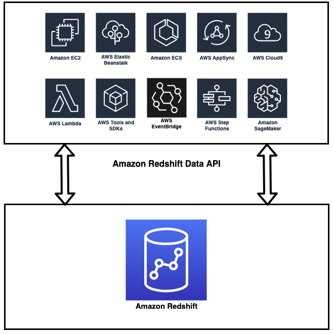

# Getting Started with Redshift Data API

In this repo we’ll be leveraging [AWS Lambda](https://aws.amazon.com/lambda/) to access Redshift Data API. You are able to access the Data API from other platforms such as [Amazon EC2](https://aws.amazon.com/ec2/?ec2-whats-new.sort-by=item.additionalFields.postDateTime&ec2-whats-new.sort-order=desc), [AWS Glue](https://aws.amazon.com/glue/), [Amazon SageMaker](https://aws.amazon.com/sagemaker/), and from your on-premises resources. Each language has its own code sample with the ultimate aim of complete language parity (same subset of examples exist in each language). 

These examples provide a demonstration on common sql operations such as create, copy, update, delete and select implementation in either synchronous or asynchronous mode that will be useful in building modern apps such as event-driven applications. 

## Introduction 

The [Amazon Redshift Data API](https://docs.aws.amazon.com/redshift/latest/mgmt/data-api.html) enables you to efficiently access data from Amazon Redshift with all types of traditional, cloud-native, and containerized, serverless web services-based applications and event-driven applications. This includes, but not limited to, AWS Lambda, Amazon SageMaker, AWS Cloud9 and many other AWS services.

Amazon Redshift Data API simplifies data access, ingest, and egress from the languages supported with AWS SDK such as Python, Go, Java, Node.js, PHP, Ruby, and C++. 

## Tutorial Overview

In this tutorial, we’ll demonstrate how to get started with Amazon Redshift Data API in different languages. We'll be leveraging [AWS Lambda](https://aws.amazon.com/lambda/) to access Redshift Data API. However, with little modifications of the code, you are able to access the Data API from other platforms such as [Amazon EC2](https://aws.amazon.com/ec2/?ec2-whats-new.sort-by=item.additionalFields.postDateTime&ec2-whats-new.sort-order=desc), [AWS Glue](https://aws.amazon.com/glue/), [Amazon SageMaker](https://aws.amazon.com/sagemaker/), and from your on-premises resources. 

We'll also demonstrate some common use-cases customers are using Redshift Data API to solve. We'll provide code examples along with CloudFormation templates for these use-cases.

## Architectural Diagram 

### About Redshift Data API

Amazon Redshift Data API by default is asynchronous. This means when executing SQL commands, you can retrieve your results later for up to 24 hours with a generated Query ID. However, you can also configure your code to have your SQL commands run synchronously.  The implementation is demonstrated within the code samples.  

## Others

* Considerations when calling the Amazon Redshift Data API: [Link](https://docs.aws.amazon.com/redshift/latest/mgmt/data-api.html#data-api-calling-considerations)

## Security

See [CONTRIBUTING](CONTRIBUTING.md#security-issue-notifications) for more information.

## License

This library is licensed under the MIT-0 License. See the LICENSE file.