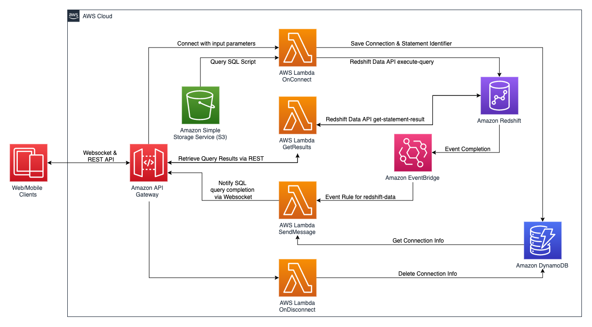
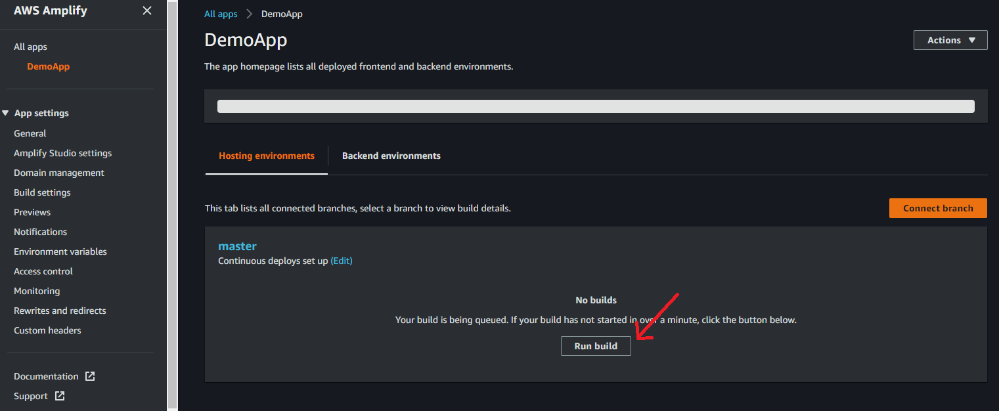
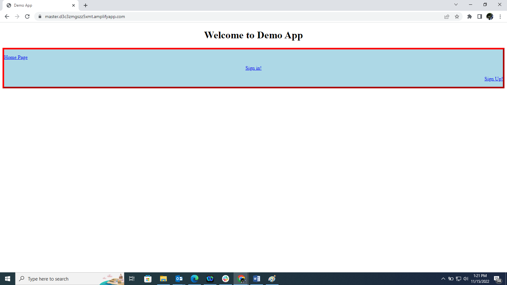

# Event Driven Web Application using Amazon Redshift Data API and Amazon API Gateway WebSockets

In this AWS Sample code, you will learn how to use [Amazon Redshift Data API](https://docs.aws.amazon.com/redshift/latest/mgmt/data-api.html) and [Amazon API Gateway](https://aws.amazon.com/api-gateway/) to create an event driven web application leveraging websockets API and REST API, and securing the web application and REST API using [Amazon Coginito](https://aws.amazon.com/cognito/).

As explained in AWS [blogpost](https://aws.amazon.com/blogs/compute/announcing-websocket-apis-in-amazon-api-gateway/), Amazon API Gateway supports [WebSocket APIs](https://docs.aws.amazon.com/apigateway/latest/developerguide/apigateway-websocket-api-overview.html), which allows developers to efficiently design event driven web applications with two-way interactive communication session between the user and the server.

WebSocket APIs becomes very useful in designing a de-coupled web architecture, when dealing with long running operations like analyzing massive amounts of data in a database. Response from the database might take multiple seconds in some cases and WebSocket implementation makes the interaction more efficient instead of traditional long polling model with REST based HTTP request/response methods.

In this repository, we are demonstrating a web application to implement similar architecture leveraging Amazon Redshift Data API and Amazon API Gateway and Amazon Cognito. Below is the architecture diagram for this application, which can be deployed in your AWS Account using the AWS CloudFormation templates. For ease the templates are being executed using a single shell script which takes care of the internal dependencies:

Below are the steps performed by this application as shown in above diagram:

1. The End user creates his profile on the web application and log into the application.  
2. End users would request data through their web/mobile clients, which would create a WebSocket connection in Amazon API Gateway.
3. The connection request is handled by an AWS Lambda function, “OnConnect”, which initiates an asynchronous database query in Amazon Redshift using Amazon Redshift Data API.
4. The OnConnect Lambda function also stores the connection and statement identifier information in an Amazon DynamoDB database, which is required by WebSockets API to send messages back to the client.
5. Amazon Redshift Data API runs the query mentioned in step #2 and once completed, it sends an event notification to Amazon EventBridge
6. Amazon EventBridge activates an event rule to re-direct that event to another Lambda function, “SendMessage”
7. The SendMessage Lambda function would then fetch and parse the results from Redshift Data API and send it back to the WebSockets client through API GateWay
8. The client would then be able to view the results pushed from Redshift using Data API
9. Once clients disconnect from their browser, API Gateway would automatically delete the connection information from the DynamoDB table.

### Prerequisite Steps:

In this sample application, we used [New York Taxi data](https://www1.nyc.gov/site/tlc/about/tlc-trip-record-data.page) for the year 2015, which is pre-populated this in an Amazon S3 bucket. 
Prior to deploying your event-driven web application, please ensure you have the following:

1. An Amazon Redshift cluster in your AWS environment.  
2. An Amazon S3 bucket that you have access to.
3. Once you have created your Amazon Redshift cluster, add AmazonS3ReadOnlyAccess permission to the associated cluster IAM role

A generic template is provided for you to customize your own DDL SQL scripts as well as your own query SQL scripts. We have created sample scripts for you to follow along.
1.	Download the sample DDL script and upload it to an existing Amazon S3 bucket. We’ll be copying New York Taxi Data 2015 from a public Amazon S3 bucket. Update the Redshift IAM policy name in the DDL script file by replacing the value of "<<YOUR_REDSHIFT_CLUSTER_IAM_ROLE>>"
2.	Download the sample query script and upload it to an existing Amazon S3 bucket. 
3.	Upload the modified sample DDL script and the sample query script into a pre-existing Amazon S3 bucket that you own and note down the Amazon S3 URI path.. 
Note: If you would like to run your own customized version, modify the DDL and query script to fit your scenario. 

### Deploy CloudFormation Template

The code associated to the design is part of the Repository. We need to clone the repository inside a Cloud9 environment in our AWS account. The Cloud9 environment comes with AWS CLI installed which will be utilized to run the cloud formation templates to setup the AWS infrastructure.  Make sure that JQ library is installed which is used to parse the JSON output during the execution of the Script. 

The complete architecture is setup using three CloudFormation Templates:
•	cognito-setup.yaml – Creates the Cognito User Pool to Web App Client which will be utilized for Authentication and protecting the Rest API. 
•	backend-setup.yaml – Creates all the required lambda functions and the Websocket and Rest API and configures them on API Gateway. 
•	webapp-setup.yaml – Creates the Web Application Hosting using AWS Amplify to connect and communicate with the Websocket and Rest API. 

These cloud formation templates are executed using the script.sh shell script taking care of all the dependencies as required. 

Edit the “script.sh” file before execution and set the values for the following parameters need for execution:

•	RedshiftClusterEndpoint (aws_redshift_cluster_ep) – Your Amazon Redshift Cluster Endpoint available in your AWS Management Console. 
•	DBUsername (aws_dbuser_name) – Your Amazon Redshift database username 
•	DDBTableName (aws_ddbtable_name) - The name of your Amazon DynamoDB table name that will be created. 
•	WebsocketEndpointSSMParameterName (aws_wsep_param_name) - Parameter name that will store the web-socket endpoint in SSM Parameter Store. 
•	RestApiEndpointSSMParameterName (aws_rapiep_param_name) - Parameter name that will store the REST API endpoint in SSM Parameter. 
•	DDLScriptS3Path (aws_ddl_script_path) - S3 URI to the DDL script that you uploaded. 
•	QueryScriptS3Path (aws_query_script_path) - S3 URI to the query script that you uploaded. 
•	AWSRegion (aws_region) – Region where the AWS infrastructure is being setup. 
•	CognitoPoolName (aws_user_pool_name) – The name you want to give to your Cognito User Pool
•	ClientAppName (aws_client_app_name) – The Name of the Client App to be configured for the Web App to handle the User authentication for the users. 

A default acceptable values are already provided as part of the downloaded code.  The script needs to be run using the following command.

./script.sh

Once the Shell Script has completed its execution you can can login to AWS console Navigate to AWS Amplify and Select the DemoApp under the All Apps. Click on “Run Build” 

The DemoApp Web Application goes through a phase of Provision -> Build -> Deploy. Once completed use the URL provided to access the Web Application. 

The Web Application Page will be as shown below. The Page has minimal functionality associated to “Sign In”, “Sign Up” and “Verify User”

More details with regards to how to test and clean up are on the [Blog Post]
(https://aws.amazon.com/blogs/big-data/build-a-serverless-analytics-application-with-amazon-redshift-and-amazon-api-gateway/)

## License

This library is licensed under the MIT-0 License. See the LICENSE file in the root directory of this repository.
