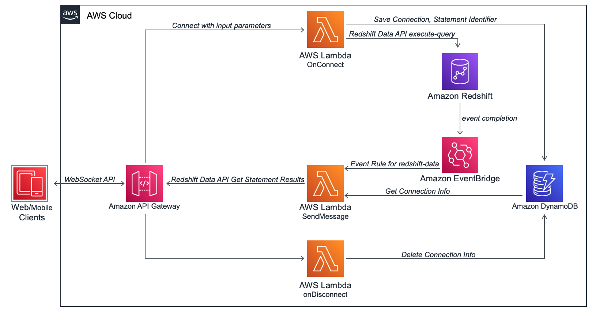

# Event Driven Web Application using Amazon Redshift Data API and Amazon API Gateway WebSockets


In this AWS Sample code, you will learn how to use [Amazon Redshift Data API](https://docs.aws.amazon.com/redshift/latest/mgmt/data-api.html) and [Amazon API Gateway](https://aws.amazon.com/api-gateway/) to create an event driven web application leveraging websockets API.

As explained in AWS [blogbost](https://aws.amazon.com/blogs/compute/announcing-websocket-apis-in-amazon-api-gateway/), Amazon API Gateway supports [WebSocket APIs](https://docs.aws.amazon.com/apigateway/latest/developerguide/apigateway-websocket-api-overview.html), which allows developers to efficiently design event driven web applications with two-way interactive communication session between the user and the server.

WebSocket APIs becomes very useful in designing a de-coupled web architecture, when dealing with long running operations like analyzing massive amounts of data in a database. Response from the database might take multiple seconds in some cases and WebSocket implementation makes the interaction more efficient instead of traditional long polling model with REST based HTTP request/response methods.

In this repository, we are demonstrating a web application to implement similar architecture leveraging Amazon Redshift Data API and Amazon API Gateway. Below is the architecture diagram for this application, which can be deployed in your AWS Account using this [AWS CloudFormation template](redshift-data-api-gw-websocket.yaml):

Below are the steps performed by this application as shown in above diagram:

1. end users would request data through their web/mobile clients, which would create a WebSocket connection in Amazon API Gateway.
2. The connection request is handled by an AWS Lambda function, “OnConnect”, which initiates an asynchronous database query in Amazon Redshift using Amazon Redshift Data API.
3. The OnConnect Lambda function also stores the connection and statement identifier information in an Amazon DynamoDB database, which is required by WebSockets API to send messages back to the client.
4. Amazon Redshift Data API runs the query mentioned in step #2 and once completed, it sends an event notification to Amazon EventBridge
5. Amazon EventBridge activates an event rule to re-direct that event to another Lambda function, “SendMessage”
6. The SendMessage Lambda function would then fetch and parse the results from Redshift Data API and send it back to the WebSockets client through API GateWay
7. The client would then be able to view the results pushed from Redshift using Data API
8. Once clients disconnect from their browser, API Gateway would automatically delete the connection information from the DynamoDB table.

### Prerequisite Steps:

In this sample application, we used [New York Taxi data](https://www1.nyc.gov/site/tlc/about/tlc-trip-record-data.page) for the year 2015, which is pre-populated this in an Amazon S3 bucket. You would need to create a table `nyc_yellow_taxi` and populate data on this table to test-deploy this application. Please run below statements in your Amazon Redshift cluster prior deploying the CloudFormation template:

```sql

DROP TABLE IF EXISTS nyc_yellow_taxi;
CREATE TABLE nyc_yellow_taxi
  (pickup_date        DATE
  , pickup_datetime  TIMESTAMP
  , dropoff_datetime TIMESTAMP
  , ratecode         SMALLINT
  , passenger_count  SMALLINT
  , trip_distance    FLOAT4
  , fare_amount      FLOAT4
  , total_amount     FLOAT4
  , payment_type     SMALLINT
  , vendorid         VARCHAR(20))
  SORTKEY(pickup_date);

  COPY nyc_yellow_taxi FROM 's3://event-driven-app-with-lambda-redshift/nyc_yellow_taxi_raw/' IAM_ROLE '<<YOUR_REDSHIFT_CLUSTER_IAM_ROLE>>' region 'us-west-2' delimiter '|';

```

### Deploy CloudFormation Template

To deploy the application using AWS CloudFormation, you would need to provide your Amazon Redshift cluster’s endpoint and an existing username who have access to query above table ``nyc_yellow_taxi`. `


Once Deployed, you may navigate to the output section of your CloudFormation stack and copy the value for parameter `RedshiftDataApiWebSocketEndpoint`


Now, you may open this [`index.html`](index.html) file in any editor and navigate to line number 20. In that, replace the value for  `wsEndpoint` variable with the value you copied in the last step.


save the [`index.html`](index.html) file and open it in your browser. Select any input month and hit submit:


You should be able to see the output in few seconds as below, which is delivered using web-socket to your web browser:


