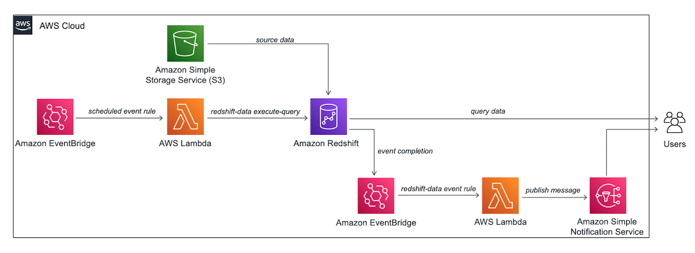
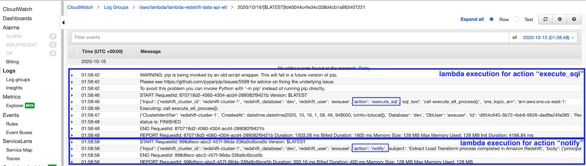
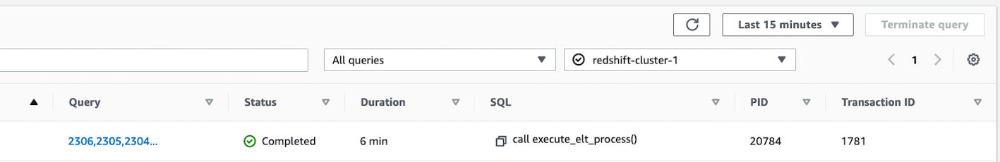

# Building Event Driven Application with AWS Lambda and Amazon Redshift Data API

## Introduction
Event driven applications are becoming popular with many customers, where application execution happens in response to events. A primary benefit of this architecture is the decoupling of producer and consumer processes, allowing greater flexibility in application design and building decoupled processes.  An example of an event driven application, that we implemented here is an automated workflow being triggered by an event, which executes series of transformations in the data warehouse, leveraging [Amazon Redshift](https://aws.amazon.com/redshift/), [AWS Lambda](https://aws.amazon.com/lambda/), [Amazon EventBridge](https://aws.amazon.com/eventbridge/) and [Amazon Simple Notification (SNS)](https://aws.amazon.com/sns/).

In response to a schedule event defined in Amazon EventBridge, this application will automatically trigger an AWS Lambda Function to execute a stored procedure performing extract, load and transform (ELT) operations in Amazon Redshift data warehouse leveraging [Amazon Redshift Data API](https://docs.aws.amazon.com/redshift/latest/mgmt/data-api.html). This stored procedure would copy the source data from Amazon Simple Storage Service (Amazon S3) to Amazon Redshift and also aggregate the results. Once complete, it’ll send an event to Amazon EventBridge, which would then trigger a lambda function to send notification to end-users through Amazon SNS Service, to inform them about the availability of updated data in Amazon Redshift.  

This event driven serverless architecture offers greater extensibility and simplicity, making it easier to maintain, faster to release new features and also reduce the impact of changes. It also simplifies adding other components or third-party products to the application without much changes.  

## Pre-requisites

As a pre-requisite for creating the application explained in this blog, you should need to setup an Amazon Redshift cluster and associate it with an [AWS Identity and Access Management (IAM) Role](https://docs.aws.amazon.com/redshift/latest/mgmt/authorizing-redshift-service.html). If you don’t have that provisioned in your AWS account, please follow [Amazon Redshift getting started guide](https://docs.aws.amazon.com/redshift/latest/gsg/getting-started.html) to set it up.

## Solution architecture

We have used [NYC Yellow Taxi public dataset](https://www1.nyc.gov/site/tlc/about/tlc-trip-record-data.page) for the year 2015. We have pre-populated this dataset in an Amazon S3 bucket folder “[event-driven-app-with-lambda-redshift/nyc_yellow_taxi_raw/](https://s3.console.aws.amazon.com/s3/buckets/event-driven-app-with-lambda-redshift/nyc_yellow_taxi_raw/?region=us-west-2&tab=overview)”.

The following architecture diagram highlights the end-to-end solution:  
  

Below is the simple execution flow for this solution, which you may deploy with [CloudFormation template](event-driven-redshift-pipeline.yaml):

1. Database objects in the Amazon Redshift cluster:
  -  Table "nyc_yellow_taxi" which will be used to copy above New York taxi dataset from Amazon S3.
  -  Materialized view "nyc_yellow_taxi_volume_analysis" providing an aggregated view of above table
  -  Stored procedure "execute_elt_process", to take care of data transformations

2. Amazon EventBridge rule, [EventBridgeScheduledEventRule](resources/EventBridgeScheduledEventRule.txt) to be triggered periodically based on a cron expression.

3. AWS IAM Role, “[LambdaRedshiftDataApiETLRole](LambdaRedshiftDataApiETLRole.json)” for AWS Lambda to allow below permissions:  
  -  Federate to the Amazon Redshift cluster through getClusterCredentials permission avoiding password credentials.
  -  Execute queries in Amazon Redshift cluster through redshift-data API calls
  -  Logging with AWS CloudWatch for troubleshooting purpose
  -  Send notifications through Amazon Simple Notification Service (SNS)

4. AWS Lambda function, “[LambdaRedshiftDataApiETL](LambdaRedshiftDataApiETL.py)”, which is triggered automatically with action “execute_sql” as soon as above scheduled event gets executed. It performs an asynchronous call to the stored procedure "execute_elt_process" in Amazon Redshift, performing extract, load and transform (ELT) operations leveraging Amazon Redshift Data API functionality. This AWS Lambda function will execute queries in Amazon Redshift leveraging “redshift-data” client. Based on the input parameter “action”, this lambda function can asynchronously execute Structured Query Language (SQL) statements in Amazon Redshift and thus avoid chances of timing-out in case of long running SQL statements. It can also publish custom notifications through Amazon Simple Notification Service (SNS). Also, it uses [Amazon Redshift Data API](https://docs.aws.amazon.com/redshift/latest/mgmt/data-api.html) temporary credentials functionality, which allows it to communicate with Amazon Redshift using AWS Identity and Access Management (IAM)permission, without the need of any password-based authentication. With Data API, there is also no need to configure drivers and connections for your Amazon Redshift cluster, which is handled automatically.

5. Amazon EventBridge rule, “[EventBridgeRedshiftEventRule](resources/EventBridgeRedshiftEventRule.txt)” to automatically capture completion event, generated by above stored procedure call. This triggers above AWS Lambda function again with action "notify"

6. AWS Simple Notification Service (SNS) topic, [RedshiftNotificationTopicSNS](resources/RedshiftNotificationTopicSNS.txt) and subscription to your emailid send an automated email notification denoting completion of ELT process as triggered by the AWS Lambda function.

7. The database objects mentioned in Step#1 above are provisioned automatically by a lambda function, [LambdaSetupRedshiftObjects](LambdaSetupRedshiftObjects.py) as part of the [CloudFormation template](event-driven-redshift-pipeline.yaml) through an invocation of the lambda function, [LambdaRedshiftDataApiETL](LambdaRedshiftDataApiETL.py) created in step# 3 above

## Testing the code:
1. After setting up above solution, you should have an automated pipeline to trigger based on the schedule you defined in Amazon EventBridge scheduled rule’s cron expression. You may view Amazon CloudWatch logs and troubleshoot issues if any in the lambda function. Below is an example of the execution logs for reference:  
  

2. You could also view the query execution status in Amazon Redshift Console, which would also allow you to view detailed execution plan for the queries you executed. One key thing to note here, though the stored procedure may take around six minutes to complete, both the executions of AWS Lambda function would finish within just few seconds. This is primarily because the executions from AWS Lambda on Amazon Redshift was asynchronous. Therefore, the lambda function gets completed after initiating the process in Amazon Redshift without caring about the query completion.  
  

3. After this process is complete, you will receive the notification email shown below to denote completion of the ELT process:  
  

## Conclusion

Amazon Redshift Data API enables you to painlessly interact with Amazon Redshift and enables you to build event-driven and cloud native applications. We demonstrated how to build an event driven application with Amazon Redshift, AWS Lambda and Amazon EventBridge. To learn more about Amazon Redshift Data API, please visit this [blog](https://aws.amazon.com/blogs/big-data/using-the-amazon-redshift-data-api-to-interact-with-amazon-redshift-clusters/) and the [documentation](https://docs.aws.amazon.com/redshift/latest/mgmt/data-api.html).

## Security

See [CONTRIBUTING](CONTRIBUTING.md#security-issue-notifications) for more information.

## License

This library is licensed under the MIT-0 License. See the LICENSE file.
