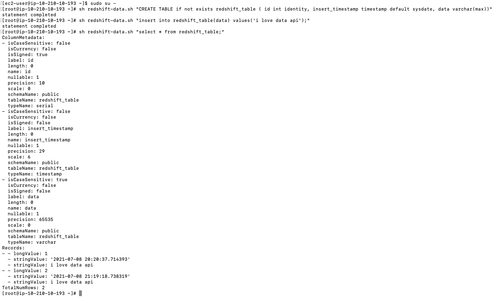
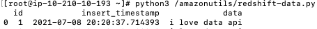

# Using the Amazon Redshift Data API from your Amazon EC2 based applications

In this AWS Sample code, you will learn how to use [Amazon Redshift Data API](https://docs.aws.amazon.com/redshift/latest/mgmt/data-api.html)to access your Amazon Redshift Data Warehouse seamlessly from your Amazon EC2 instance using IAM credentials without any password management hassles.

You may use this AWS CloudFormation template to provision this setup, which would provision an Amazon EC2 instance, that you may use to connect with Amazon Redshift using IAM credentials.

Once Setup, please ssh into the EC2 instance an run below commands to test connectivity with Redshift

‘’‘sql
sh redshift-data.sh "CREATE TABLE if not exists redshift_table ( id int identity, insert_timestamp timestamp default sysdate, data varchar(max))"

sh redshift-data.sh "insert into redshift_table(data) values('i love data api');"

sh redshift-data.sh "select * from redshift_table;"
‘’‘

You may also test python scripts from this EC2 instance using beloc commands:

python3 /amazonutils/redshift-data.py

