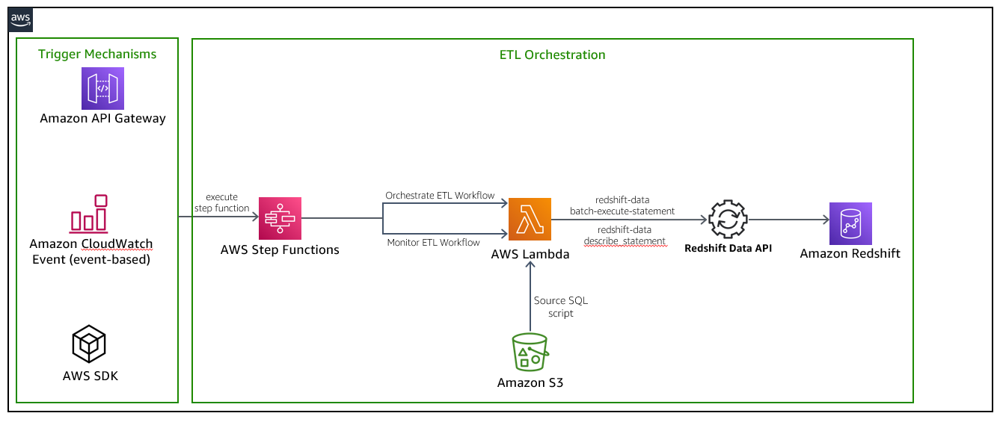
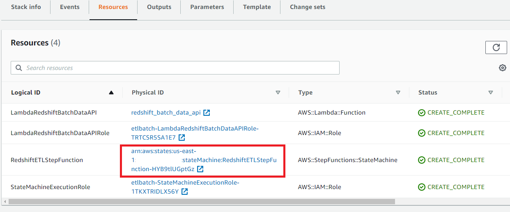
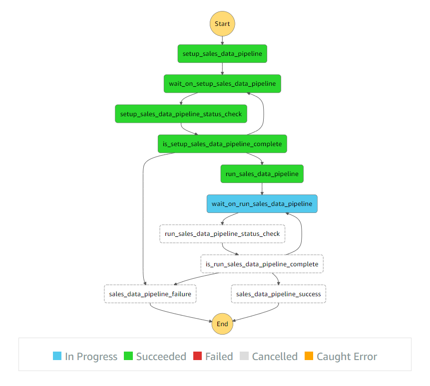
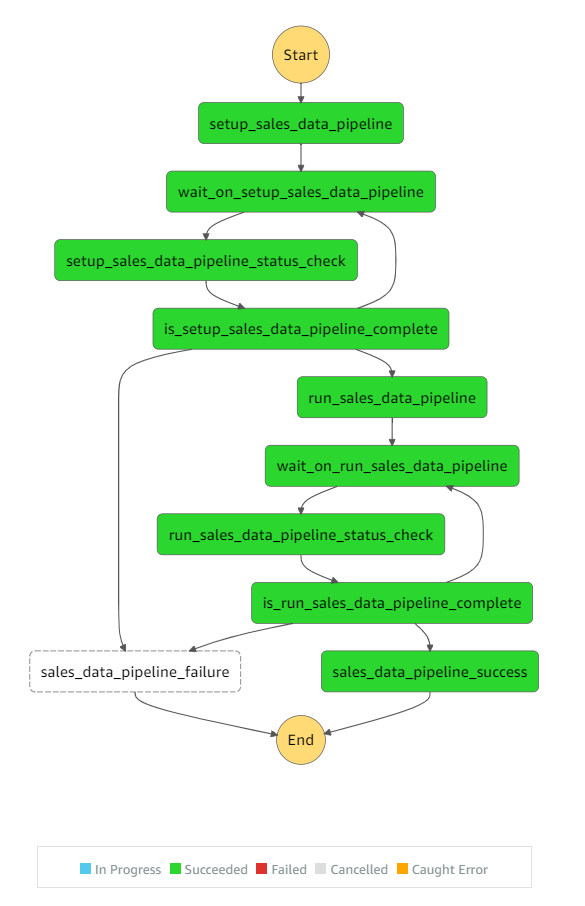

<!DOCTYPE html>
<html>
<head>
<title>README.md - Amazon-redshift-data-api-getting-started - Code Browser</title>
<meta content='width=device-width, initial-scale=1' name='viewport'>
<meta content='true' name='use-sentry'>
<meta content='9ceb4ff3-7c15-45c4-beb8-f180da39f876' name='request-id'>
<meta name="csrf-param" content="authenticity_token" />
<meta name="csrf-token" content="TR4eh1LQxNCboqCcCE3nxpFVVuao4qL20hFcbjBtmwtx9kB2E+dJbw2dywz5txPg4HfYZTDaw3ou2/6800ytgg==" />
<meta content='IE=edge' http-equiv='X-UA-Compatible'>

<link rel="shortcut icon" type="image/x-icon" href="https://internal-cdn.amazon.com/code.amazon.com/pub/assets/cdn/favicon-c8c77da180d3e9e679dac48d5ae77858edd6974d6a2a78b1705dc0b499c1d7c2.ico" />
<link rel="stylesheet" media="all" href="https://m.media-amazon.com/images/G/01/oneg/assets/3.2.4/css/application.min.css" />
<link rel="stylesheet" media="all" href="https://internal-cdn.amazon.com/code.amazon.com/pub/assets/cdn/vendor-90acffb4f83d4fac4e18700dd74243643e9d8b5e81b5c61e7e52383ae980ab29.css" />
<link rel="stylesheet" media="all" href="https://internal-cdn.amazon.com/code.amazon.com/pub/assets/cdn/application-oneg-b0d2918a35db96d2b15378ac99385b5e1e01275304cdd53ccab39522e1054546.css" />
<link rel="stylesheet" media="all" href="https://internal-cdn.amazon.com/is-it-down.amazon.com/stylesheets/stripe.css" />

<link rel="stylesheet" media="screen" href="https://internal-cdn.amazon.com/code.amazon.com/pub/assets/cdn/spiffy_diffy_assets/spiffy_diffy-ae36511172a0f079b00af773e85db1f4d5487f8f415e97b89baaae2c05113dd3.css" />
<link rel="stylesheet" media="screen" href="https://internal-cdn.amazon.com/code.amazon.com/pub/assets/cdn/blobs-b13b6a7caacd4135de19896de8b46573cb30e250f79cfa77c7916f397be6f24f.css" />

</head>
<body>
<nav class='navbar navbar-default hidden-print' role='navigation'>

<a class='navbar-brand' href='/' title='Code Browser Website'>
Code Browser
</a>

<ul class='nav navbar-nav'>
<li>

<!-- / preserves query and redirects to advanced search -->

<form action='/search' class='form-inline navbar-search navbar-form'>

<input accesskey='s' class='hinted input-medium autocomplete-packages search-query form-control search' data-autocomplete-url='/packages/autocomplete_package_id?vs=true' id='search_top' name='term' placeholder='Code Search' role='search' size='40' tabindex='1' title='Code Search' type='text'>

<h3 class='popover-title'>Code Search Hints</h3>

<strong class='external text'>
<a href='/search' rel='nofollow'>Advanced Search</a>
</strong>

<strong>Simple search:</strong>
&lt;term&gt;

<strong>Prefix search:</strong>
&lt;at-least-three-chars&gt;*

<strong>Find files with at least one of two terms (logical OR):</strong>
&lt;term1&gt; &lt;term2&gt;

<strong>Find files with at least one of two terms but not a third term:</strong>
&lt;term1&gt; &lt;term2&gt;&nbsp;!&lt;term3&gt;

<strong>Find files with two terms in sequence:</strong>
"&lt;term1&gt; &lt;term2&gt;"

<strong>Filter to only one or more repository:</strong>
&lt;term1&gt; rp:&lt;MyPackageName&gt; ...

<strong>Filter to a particular file extension:</strong>
&lt;term1&gt; path:.java

<strong>Filter out a particular file extension (works w/ all filters):</strong>
&lt;term1&gt; path:!.java

<strong>Find files with two terms with filters (logical AND):</strong>
&lt;term1&gt; &lt;term2&gt; path:.md ...

<strong>Filter to a path: &lt;term1&gt;</strong>
path:/my/path/to/consider*

<strong>Filter by write permissions:</strong>
group:&lt;some-ldap-posix-or-source-group&gt;

<strong>Filter by package status:</strong>
status:active:deprecated

<strong>Filter by branch: branch:&lt;branch-name&gt;</strong>

<strong>Filter by third party:</strong>
third_party:true|false

<strong>Filter by particular class in java files:</strong>
class:&lt;class_name&gt;

<strong>Filter by method declarations in java files:</strong>
method:&lt;method_name&gt;

<strong>Filter by method calls in java files:</strong>
method_call:&lt;method_name&gt;

<strong>Filter by interface declarations in java files:</strong>
interface:&lt;interface_name&gt;

<a class='external text' href='https://builderhub.corp.amazon.com/docs/code-browser/user-guide/code-search.html' rel='nofollow'>Read more here</a>

<i>(click on the speech bubble to close)</i>

</form>
</li>
<li>
<a href="/permissions">Permissions</a>
</li>
<li>
<a href="/workspaces/pedrezaj">Workspaces</a>
</li>
<li>
<a href="/version-sets">Version Sets</a>
</li>
<li>
<a href="/reviews">Code Reviews</a>
</li>
<li>
<a data-target='#preferences_dialog' data-toggle='modal' id='preferences'>Preferences</a>

<button class='close' data-dismiss='modal' type='button'>
<i class='fa fa-times'></i>
</button>
<h4 class='modal-title'>User Preferences</h4>

<i class='fa fa-spinner fa-spin'></i>

</li>
</ul>

<a class='tag-link' href='https://w.amazon.com/bin/view/BuilderTools/Groups/Codex/Hiring/' target='_blank'>We are hiring!</a>

<ul class='nav navbar-nav navbar-right parent-button-container'>
<li>
<button class='btn nav-button' id='tiny-link'>Tiny Link</button>
</li>
</ul>

</nav>

<ol class='breadcrumb'>
<li>
<a href="/">Home</a>
</li>
<li><a href="/packages/Amazon-redshift-data-api-getting-started">Amazon-redshift-data-api-getting-started</a></li>
<li><a href="/packages/Amazon-redshift-data-api-getting-started/trees/mainline/--/">mainline</a></li>
<li><a href="/packages/Amazon-redshift-data-api-getting-started/trees/mainline/--/use-cases">use-cases</a></li>
<li><a href="/packages/Amazon-redshift-data-api-getting-started/trees/mainline/--/use-cases/etl-orchestration-with-lambda-and-step-functions">etl-orchestration-with-lambda-and-step-functions</a></li>
<li class='.active'>README.md</li>

</ol>

<h1>

Amazon-redshift-data-api-getting-started

<small class='hidden-print'>
<a class='powertip autoselect pull-right' data-powertip='brazil ws use -p Amazon-redshift-data-api-getting-started' id='bw_use'>
<i class='glyphicon glyphicon-download-alt'></i>
</a>
</small>
<small>

<form class='form-inline'>
Clone uri:
<input class='form-control input-sm' type='text' value='ssh://git.amazon.com/pkg/Amazon-redshift-data-api-getting-started'>
</form>

</small>
<small>

<form class="form-inline" action="/search_redirector" accept-charset="UTF-8" method="get"><input name="utf8" type="hidden" value="&#x2713;" />

<input type="text" name="search_term" id="search_term" placeholder="Search in this package" size="21" class="form-control input-sm" />
<button class='btn' type='submit'>Go</button>
<input type="hidden" name="package" id="package" value="Amazon-redshift-data-api-getting-started" />
<input type="hidden" name="path" id="path" value="use-cases/etl-orchestration-with-lambda-and-step-functions/README.md" />
</form>

</small>
</h1>

&nbsp

Third Party Package

<h3 class='popover-title'>Hint</h3>

Package badge data is extracted from brazil metadata about a package.  Particularly, Code Browser finds the highest major version and fetches data about that package version from the latest build in the primary version set.

The metadata we have is based on following brazil conventions about where to place documentation and unit test (and coverage) output.  Here are a few other wiki pages that have more detailed information about these topics.

<ul>
<li>
Each
<a class='external text' href='https://w.amazon.com/index.php/BrazilBuildSystem/BuildSystems' rel='nofollow'>build system</a>
may have ways to configure build artifacts that the Brazil system recognizes.
</li>
<li>
Java - if you use
<a class='external text' href='https://w.amazon.com/index.php/BrazilBuildSystem/HappierTrails' rel='nofollow'>Happier Trails</a>
you should get test, documentation, and coverage data out of the box.
</li>
<li>
This
<a class='external text' href='https://w.amazon.com/index.php/BrazilBuildSystem/Concepts/UnitTestingInBrazil/JavaUnitTesting' rel='nofollow'>Java Unit Testing</a>
page describes the basic conventions underlying test output.  Most any language / build system can output usable information just by putting the right files in the right places.
</li>
</ul>

Here are some example packages for a few languages that are configured to expose this information to Brazil:

<ul>
<li>
Java -
<a class='external text' href='https://code.amazon.com/packages/ToolsPermsService/blobs/mainline/--/build.xml' rel='nofollow'>ToolsPermsService</a>
</li>
<li>
Ruby -
<a class='external text' href='https://code.amazon.com/packages/CriticService/blobs/mainline/--/Rakefile' rel='nofollow'>CriticService</a>
(
<a class='external text' href='https://w.amazon.com/index.php/BuilderTools/Product/BrazilRake' rel='nofollow'>BrazilRake's</a>
SimpleCov does most of the work)
</li>
<li>
Python -
<a class='external text' href='https://code.amazon.com/packages/Ducky/blobs/62906a55e2c53e9dc779a00770b39b0620d74c45/--/Config#line-48' rel='nofollow'>Ducky</a>
</li>
<li>
Perl - ?
</li>
</ul>

<ul class='nav nav-pills bottom-buffer-small hidden-print'>
<li class='active'><a href="/packages/Amazon-redshift-data-api-getting-started">Source</a></li>
<li><a href="/packages/Amazon-redshift-data-api-getting-started/logs">Commits</a></li>
<li><a href="/packages/Amazon-redshift-data-api-getting-started/releases">Releases</a></li>
<li><a href="/packages/Amazon-redshift-data-api-getting-started/metrics/28a67ed63469e767ff917f71d9697275aa578490">Metrics</a></li>
<li><a href="/packages/Amazon-redshift-data-api-getting-started/permissions">Permissions</a></li>
<li><a href="/gc/rules/for-package/Amazon-redshift-data-api-getting-started">CRUX Rules</a></li>
<li><a href="/packages/Amazon-redshift-data-api-getting-started/repo-info">Repository Info</a></li>
<li><a href="/packages/Amazon-redshift-data-api-getting-started/replicas">CodeCommit Replicas</a></li>
</ul>

<label for="branches">Branches: </label>
<input id='branches' name='branches' type='hidden'>

Last Commit

(<a class="commit-see-more" href="#">see more</a>)

<ul class='last-commit-summary list-unstyled list-inline'>
<li class='commiter'></li>
<a title="rzhamzn-at-601176997573" href="https://code.amazon.com/users/rzhamzn/activity">rzhamzn-at-601176997573</a>
<li class='time'></li>
about 2 months ago2022-01-11 23:11:29 PST
<li class='commit_message'>

<a class='powertip commit black' data-commit-id='28a67ed63469e767ff917f71d9697275aa578490' href='/packages/Amazon-redshift-data-api-getting-started/commits/28a67ed63469e767ff917f71d9697275aa578490'>
sync
</a>
</li>
<li><a class="mono powertip autoselect" data-powertip="28a67ed63469e767ff917f71d9697275aa578490" data-commit-id="28a67ed63469e767ff917f71d9697275aa578490" href="/packages/Amazon-redshift-data-api-getting-started/commits/28a67ed63469e767ff917f71d9697275aa578490#use-cases/etl-orchestration-with-lambda-and-step-functions/README.md">28a67ed6</a></li>
<li>

<a href="https://pipelines.amazon.com/changes/PKG/Amazon-redshift-data-api-getting-started/mainline/GitFarm:28a67ed63469e767ff917f71d9697275aa578490">Track in pipelines</a>
</li>
</ul>

<ul class='list-unstyled'>
<li>

<a href="https://pipelines.amazon.com/changes/PKG/Amazon-redshift-data-api-getting-started/mainline/GitFarm:28a67ed63469e767ff917f71d9697275aa578490">Track in pipelines</a>
(mainline)
</li>
</ul>

<a href="/api/packages/Amazon-redshift-data-api-getting-started/diff/28a67ed63469e767ff917f71d9697275aa578490">Download Diff</a>

<a href="/packages/Amazon-redshift-data-api-getting-started/trees/28a67ed63469e767ff917f71d9697275aa578490">Browse source at this commit</a>

<a href="/packages/Amazon-redshift-data-api-getting-started/commits/28a67ed63469e767ff917f71d9697275aa578490.child">view child commit</a>

<ul class='list-unstyled pull-right' style='clear: right; margin-bottom: 0px'>
<li><a href="/packages/Amazon-redshift-data-api-getting-started/commits/cc439589df2c0d50b6965e6e41f6da2e80a64931">view parent (cc439589)</a></li></ul>

<h4>
Related Items
<small class='add_relation_link'>
<a href='#'>+Add</a>
</small>
</h4>

Fetching...

(none)

<ul class='list-unstyled' data-bind='foreach: relatedItemsModel().relatedItems, visible: relatedItemsModel().relatedItems().length &gt; 0'>
<li>

<a class='delete_relation' data-bind='attr: {href: &#39;/delete-relation?eid=&#39; + link.eid}' onclick='return confirm(&quot;Really delete this relation?&quot;)'>
&nbsp;x&nbsp;
</a>
</li>
</ul>

<form action="/create_relation" accept-charset="UTF-8" method="post"><input name="utf8" type="hidden" value="&#x2713;" /><input type="hidden" name="authenticity_token" value="G7IufGrEYusefQeBDtg8eO88RjDqc3HCu2beFx353aEnWnCNK/PvVIhCbBH/Ishenh7Is3JLEE5HrHzF/tjrKA==" />
Relate this commit to url:
<input name='relation' type='text'>
<input type="hidden" name="package_id" id="package_id" value="Amazon-redshift-data-api-getting-started" />
<input type="hidden" name="commit_id" id="commit_id" value="28a67ed63469e767ff917f71d9697275aa578490" />
<input type="submit" name="commit" value="Save" class="btn btn-default" data-disable-with="Save" />
</form>

<a title="rzhamzn-at-601176997573" href="https://code.amazon.com/users/rzhamzn/activity">rzhamzn-at-601176997573</a>

(<a class='powertip autoselect' data-powertip='28a67ed63469e767ff917f71d9697275aa578490' href='/packages/Amazon-redshift-data-api-getting-started/commits/28a67ed63469e767ff917f71d9697275aa578490'>28a67ed6</a>)

authored: about 2 months ago2022-01-11 23:11:29 PST, committed: about 2 months ago2022-01-11 23:11:29 PST

Pushed to
mainline
by rzhamzn about 2 months ago2022-01-11 23:12:02 PST as part of <a class='powertip autoselect' data-powertip='76c18ab13cdcb7f10c5c77d184b8cab6e0246f91' href='/packages/Amazon-redshift-data-api-getting-started/commits/76c18ab13cdcb7f10c5c77d184b8cab6e0246f91'>76c18ab1</a>

<a href="/packages/Amazon-redshift-data-api-getting-started/commits/28a67ed63469e767ff917f71d9697275aa578490">sync</a>

<form class='form_inline' onSubmit='return false'>
<input type="hidden" name="package_id" id="package_id" value="Amazon-redshift-data-api-getting-started" />
<input type="hidden" name="commit_id_for_file" id="commit_id_for_file" value="mainline" />

<input accesskey='j' class='hinted form-control search' id='filesearch' name='file' placeholder='Jump to a file' title='Jump to a file' type='text'>

</form>

The above file can not be found. Either the whole path is missing or the file is not in
 this package. Please check the autosuggestions. 

<!--
mime_type: text/plain; charset=utf-8
-->

<a href="/packages/Amazon-redshift-data-api-getting-started">Amazon-redshift-data-api-getting-started</a>/<a href="/packages/Amazon-redshift-data-api-getting-started/trees/mainline/--/">mainline</a>/<a href="/packages/Amazon-redshift-data-api-getting-started/trees/mainline/--/use-cases">use-cases</a>/<a href="/packages/Amazon-redshift-data-api-getting-started/trees/mainline/--/use-cases/etl-orchestration-with-lambda-and-step-functions">etl-orchestration-with-lambda-and-step-functions</a>/README.md

<ul class='button_group'>
<li>
<a class="minibutton" href="/packages/Amazon-redshift-data-api-getting-started/blobs/mainline/--/use-cases/etl-orchestration-with-lambda-and-step-functions/README.md?raw=1">Raw</a>
</li>
<li>
<a class="minibutton" href="/packages/Amazon-redshift-data-api-getting-started/blobs/mainline/--/use-cases/etl-orchestration-with-lambda-and-step-functions/README.md?download=1">Download</a>
</li>
<li>
<a class="minibutton" href="/packages/Amazon-redshift-data-api-getting-started/logs/mainline?path=use-cases%2Fetl-orchestration-with-lambda-and-step-functions%2FREADME.md">History</a>
</li>
<li>
<a class="minibutton" href="/packages/Amazon-redshift-data-api-getting-started/blobs/mainline/--/use-cases/etl-orchestration-with-lambda-and-step-functions/README.md/edit_file_online">Edit</a>
</li>
<li>
<a class="minibutton md_control_raw" href="#raw_markdown">Markdown Source</a>
</li>
<li>
<a class="minibutton md_control_rendered selected active" href="#">Rendered Markdown</a>
</li>
<li class='permalink'>
<a class="minibutton" href="/packages/Amazon-redshift-data-api-getting-started/blobs/28a67ed63469e767ff917f71d9697275aa578490/--/use-cases/etl-orchestration-with-lambda-and-step-functions/README.md">Permalink</a>
</li>
</ul>

<markdown add-raw-if-needed='true'>
# ETL Orchestration using Amazon Redshift Data API and AWS Step Functions
The [Amazon Redshift Data API](https://docs.aws.amazon.com/redshift/latest/mgmt/data-api.html) is suitable for use cases where you don’t need a persistent connection to a cluster. One of its applicable use case is building your ETL pipelines with [AWS Step Functions](https://aws.amazon.com/step-functions/) and [AWS Lambda](https://aws.amazon.com/lambda/). In this AWS Sample code, you will learn how to use AWS Step Functions and Amazon Redshift Data API to orchestrate the different steps in your ETL/ELT workflow that loads data into [Amazon Redshift](https://aws.amazon.com/redshift/) data warehouse. 

In this solution, [AWS Step Functions](https://aws.amazon.com/step-functions/) uses the [AWS Lambda](https://aws.amazon.com/lambda/) function and [Amazon Redshift Data API](https://docs.aws.amazon.com/redshift/latest/mgmt/data-api.html) to setup the required database objects and generate a set of sample data to be processed. It then executes two dimension jobs that performs SCD1 and SCD2 dimension load respectively, and once both jobs have been executed successfully only then will the load job for the fact table execute. And finally as a last step, it performs a validation to ensure the sales data  was loaded successfully.

In this example, `batch-execute-statement` is used to run multiple SQL statements in a batch as a part of a single transaction on the Amazon Redshift Data API. The SQL statements can be `SELECT`, `DML`, `DDL`, `COPY`, and `UNLOAD`. For more information, please checkout [BatchExecuteStatement API Documentation](https://docs.aws.amazon.com/redshift-data/latest/APIReference/API_BatchExecuteStatement.html). 

# Pre-requisites
As a pre-requisite for creating the application explained in this repo, you should need to setup an Amazon Redshift cluster and associate it with an AWS Identity and Access Management (IAM) [Role](https://docs.aws.amazon.com/redshift/latest/mgmt/authorizing-redshift-service.html). If you don’t have that provisioned in your AWS account, please follow Amazon Redshift getting started [guide](https://docs.aws.amazon.com/redshift/latest/gsg/getting-started.html) to set it up.

You will also need to download the following SQL scripts used in this solution and store them in your S3 bucket:

* [setup_sales_data_pipeline.sql](scripts/setup_sales_data_pipeline.sql) - Contains the steps to create the tables and populate with sample data
* [run_sales_data_pipeline.sql](scripts/run_sales_data_pipeline.sql) - Contains the steps to perform the ETL processing on the customer_address, item and sales tables

# Solution Architecture
The following architecture diagram highlights the end-to-end solution:

In this sample, the triggering mechanism will be to [Start a new execution](https://docs.aws.amazon.com/step-functions/latest/dg/getting-started.html#start-new-execution) in the Step Functions console however AWS Step Functions can be executed in a number of ways as per the following:
* Call the [StartExecution](https://docs.aws.amazon.com/step-functions/latest/apireference/API_StartExecution.html) API action. 
* Use [Amazon CloudWatch Events](https://docs.aws.amazon.com/step-functions/latest/dg/tutorial-cloudwatch-events-s3.html) to start an execution. 
* Start an execution with [Amazon API Gateway](https://docs.aws.amazon.com/step-functions/latest/dg/tutorial-api-gateway.html). 
* Start a [nested workflow execution](https://docs.aws.amazon.com/step-functions/latest/dg/concepts-nested-workflows.html) from a Task state. 

Solution can be deployed with the [Cloud Formation Template](cloud_formation_template/etl-orchestration-with-stepfunctions-and-redshift-data-api.yaml) that creates the below resources: 
1. Database objects in the Amazon Redshift cluster
	* Five Redshift tables - to be used by the ETL workflow 
		1. customer
		2. customer_address
		3. date_dim
		4. item
		5. store_sales
2. [AWS IAM Role](https://docs.aws.amazon.com/IAM/latest/UserGuide/id_roles.html), `LambdaRedshiftBatchDataAPIRole` for AWS Lambda to allow below permissions:
    * Federate to the Amazon Redshift cluster through `getClusterCredentials` permission avoiding password credentials.
    * Execute queries in Amazon Redshift cluster through Redshift Data API calls
    * Logging with AWS CloudWatch for troubleshooting purpose
    * List and retrieves objects from Amazon S3
3. [AWS IAM Role](https://docs.aws.amazon.com/IAM/latest/UserGuide/id_roles.html), `StateMachineExecutionRole` for AWS Step Functions to allow below permissions:
    * Execute the `redshift_batch_data_api` lambda function within the Step Function
4. [AWS Lambda function](https://docs.aws.amazon.com/lambda/latest/dg/welcome.html), `redshift_batch_data_api` is executed as soon as the Step Function is executed. The AWS Lambda function will execute SQL statements in Amazon Redshift leveraging the `redshift-data` client. Based on the input parameter `action` that is passed by the AWS Step Function, this lambda function can asynchronously execute Structured Query Language (SQL) statements in Amazon Redshift and thus avoid chances of timing-out in case of long running SQL statements. It uses [Amazon Redshift Data API&#39;s](https://docs.aws.amazon.com/redshift/latest/mgmt/data-api.html) temporary credentials functionality, which allows it to communicate with Amazon Redshift using AWS Identity and Access Management (IAM) permission, without the need of any password-based authentication. With Data API, there is also no need to configure drivers and connections for your Amazon Redshift cluster, which is handled automatically.

   As there are multiple SQL statements that needs to be executed as a part of a single transaction to ensure data integrity, these SQL statements will be executed in a batch using the [&quot;batch-execute-statement&quot; API.](https://docs.aws.amazon.com/redshift-data/latest/APIReference/API_BatchExecuteStatement.html)

5. [AWS Step Functions state machine](https://docs.aws.amazon.com/step-functions/latest/dg/welcome.html), `RedshiftETLStepFunction`, which contains the steps used to orchestrate AWS services and build serverless applications.

# Goal of the Archictecture  
1) Deploy Redshift Database Objects
2) Load a set of sample data 
3) Run the multi-step ETL process as per the defined job dependencies
4) Validate the data was processed successfully

# Steps
1. Once the [Cloud Formation Template](cloud_formation_template/etl-orchestration-with-stepfunctions-and-redshift-data-api.yaml) is deployed, go to the &quot;Resources&quot; and click on the Physical ID column of the `RedshiftETLStepFunction` in order to navigate to the [AWS Step Function](https://aws.amazon.com/step-functions/) console.

2. Click the &quot;Start execution&quot; button using the default settings to execute the `RedshiftETLStepFunction` step function that allows you to visualize the execution of the ETL workflow in real time.

Below steps outlines the workflow:

1. `setup_sales_data_pipeline`
	* Invokes the `redshift_batch_data_api` lambda function and sends a `setup_sales_data_pipeline` action
	* Retrieves the [setup_sales_data_pipeline.sql](scripts/setup_sales_data_pipeline.sql) from S3 to get the SQL statements to be executed
	* Pass the SQL statements to the [&quot;batch-execute-statement&quot; API](https://docs.aws.amazon.com/redshift-data/latest/APIReference/API_BatchExecuteStatement.html) to run in the [Amazon Redshift](https://aws.amazon.com/redshift/) cluster
	* Sends back the identifier of the SQL statement to the step function 			
2. `wait_on_setup_sales_data_pipeline`
	* Waits for at least 10 seconds
3. `setup_sales_data_pipeline_status_check`
	* Invokes the `redshift_batch_data_api` lambda function and sends a `get_sql_status` action to get the status of the API call
4. `is_setup_sales_data_pipeline_complete` - routes the next step of the ETL workflow as per the following:
	* FINISHED - Execute the SQL statements to process the two dimension tables (customer_address and item) and one fact table (sales)
	* FAILED - Go to `sales_data_pipeline_failure` step and fail the ETL workflow
	* All other status - Go back to the `wait_on_setup_sales_data_pipeline` step to wait for the SQL statements to finish
	
5. `run_sales_data_pipeline`
	* Invokes the `redshift_batch_data_api` lambda function and sends a `run_sales_data_pipeline` action
	* Retrieves the [run_sales_data_pipeline.sql](scripts/run_sales_data_pipeline.sql) from S3 to get the SQL statements to be executed
	* Pass the SQL statements to the [&quot;batch-execute-statement&quot; API.](https://docs.aws.amazon.com/redshift-data/latest/APIReference/API_BatchExecuteStatement.html) to run in the [Amazon Redshift](https://aws.amazon.com/redshift/) cluster
	* Sends back the identifier of the SQL statement to the step function 			
6. `wait_on_run_sales_data_pipeline`
	* Waits for at least 10 seconds
7. `run_sales_data_pipeline_status_check`
	* Invokes the `redshift_batch_data_api` lambda function and sends a `get_sql_status` action to get the status of the API call
8. `is_run_sales_data_pipeline_complete` - routes the next step of the ETL workflow as per the following:
	* FINISHED - Go to `sales_data_pipeline_success` step and stop the ETL worklow
	* FAILED - Go to `sales_data_pipeline_failure` step and fail the ETL workflow
	* All other status - Go back to the `wait_on_run_sales_data_pipeline` step to wait for the SQL statements to finish			
		
**Note**: The implementation of the ETL workflow is idempotent. If it fails, you can retry the job without any cleanup. For example, it recreates the `stg_store_sales` table each time, then deletes target table `store_sales` with the data for the particular refresh date each time.

# Validation
The entire ETL workflow takes around 1 minute to run and you should see the following diagram when the ETL workflow execution completed successfully.

</markdown>

  
    

      <table class="code js-syntax-highlight">
        <tbody>
          
            
            <tr class="line_holder" id="L1">
              <td class="line-num" data-linenumber="1">
                
              </td>
              
              <td class="line_content"># ETL Orchestration using Amazon Redshift Data API and AWS Step Functions
</td>
            </tr>
          
            
            <tr class="line_holder" id="L2">
              <td class="line-num" data-linenumber="2">
                
              </td>
              
              <td class="line_content">The [Amazon Redshift Data API](https://docs.aws.amazon.com/redshift/latest/mgmt/data-api.html) is suitable for use cases where you don’t need a persistent connection to a cluster. One of its applicable use case is building your ETL pipelines with [AWS Step Functions](https://aws.amazon.com/step-functions/) and [AWS Lambda](https://aws.amazon.com/lambda/). In this AWS Sample code, you will learn how to use AWS Step Functions and Amazon Redshift Data API to orchestrate the different steps in your ETL/ELT workflow that loads data into [Amazon Redshift](https://aws.amazon.com/redshift/) data warehouse. 
</td>
            </tr>
          
            
            <tr class="line_holder" id="L3">
              <td class="line-num" data-linenumber="3">
                
              </td>
              
              <td class="line_content">
</td>
            </tr>
          
            
            <tr class="line_holder" id="L4">
              <td class="line-num" data-linenumber="4">
                
              </td>
              
              <td class="line_content">In this solution, [AWS Step Functions](https://aws.amazon.com/step-functions/) uses the [AWS Lambda](https://aws.amazon.com/lambda/) function and [Amazon Redshift Data API](https://docs.aws.amazon.com/redshift/latest/mgmt/data-api.html) to setup the required database objects and generate a set of sample data to be processed. It then executes two dimension jobs that performs SCD1 and SCD2 dimension load respectively, and once both jobs have been executed successfully only then will the load job for the fact table execute. And finally as a last step, it performs a validation to ensure the sales data  was loaded successfully.
</td>
            </tr>
          
            
            <tr class="line_holder" id="L5">
              <td class="line-num" data-linenumber="5">
                
              </td>
              
              <td class="line_content">
</td>
            </tr>
          
            
            <tr class="line_holder" id="L6">
              <td class="line-num" data-linenumber="6">
                
              </td>
              
              <td class="line_content">
</td>
            </tr>
          
            
            <tr class="line_holder" id="L7">
              <td class="line-num" data-linenumber="7">
                
              </td>
              
              <td class="line_content">In this example, `batch-execute-statement` is used to run multiple SQL statements in a batch as a part of a single transaction on the Amazon Redshift Data API. The SQL statements can be `SELECT`, `DML`, `DDL`, `COPY`, and `UNLOAD`. For more information, please checkout [BatchExecuteStatement API Documentation](https://docs.aws.amazon.com/redshift-data/latest/APIReference/API_BatchExecuteStatement.html). 
</td>
            </tr>
          
            
            <tr class="line_holder" id="L8">
              <td class="line-num" data-linenumber="8">
                
              </td>
              
              <td class="line_content">
</td>
            </tr>
          
            
            <tr class="line_holder" id="L9">
              <td class="line-num" data-linenumber="9">
                
              </td>
              
              <td class="line_content"># Pre-requisites
</td>
            </tr>
          
            
            <tr class="line_holder" id="L10">
              <td class="line-num" data-linenumber="10">
                
              </td>
              
              <td class="line_content">As a pre-requisite for creating the application explained in this repo, you should need to setup an Amazon Redshift cluster and associate it with an AWS Identity and Access Management (IAM) [Role](https://docs.aws.amazon.com/redshift/latest/mgmt/authorizing-redshift-service.html). If you don’t have that provisioned in your AWS account, please follow Amazon Redshift getting started [guide](https://docs.aws.amazon.com/redshift/latest/gsg/getting-started.html) to set it up.
</td>
            </tr>
          
            
            <tr class="line_holder" id="L11">
              <td class="line-num" data-linenumber="11">
                
              </td>
              
              <td class="line_content">
</td>
            </tr>
          
            
            <tr class="line_holder" id="L12">
              <td class="line-num" data-linenumber="12">
                
              </td>
              
              <td class="line_content">You will also need to download the following SQL scripts used in this solution and store them in your S3 bucket:
</td>
            </tr>
          
            
            <tr class="line_holder" id="L13">
              <td class="line-num" data-linenumber="13">
                
              </td>
              
              <td class="line_content">
</td>
            </tr>
          
            
            <tr class="line_holder" id="L14">
              <td class="line-num" data-linenumber="14">
                
              </td>
              
              <td class="line_content">* [setup_sales_data_pipeline.sql](scripts/setup_sales_data_pipeline.sql) - Contains the steps to create the tables and populate with sample data
</td>
            </tr>
          
            
            <tr class="line_holder" id="L15">
              <td class="line-num" data-linenumber="15">
                
              </td>
              
              <td class="line_content">* [run_sales_data_pipeline.sql](scripts/run_sales_data_pipeline.sql) - Contains the steps to perform the ETL processing on the customer_address, item and sales tables
</td>
            </tr>
          
            
            <tr class="line_holder" id="L16">
              <td class="line-num" data-linenumber="16">
                
              </td>
              
              <td class="line_content">
</td>
            </tr>
          
            
            <tr class="line_holder" id="L17">
              <td class="line-num" data-linenumber="17">
                
              </td>
              
              <td class="line_content"># Solution Architecture
</td>
            </tr>
          
            
            <tr class="line_holder" id="L18">
              <td class="line-num" data-linenumber="18">
                
              </td>
              
              <td class="line_content">The following architecture diagram highlights the end-to-end solution:
</td>
            </tr>
          
            
            <tr class="line_holder" id="L19">
              <td class="line-num" data-linenumber="19">
                
              </td>
              
              <td class="line_content">
</td>
            </tr>
          
            
            <tr class="line_holder" id="L20">
              <td class="line-num" data-linenumber="20">
                
              </td>
              
              <td class="line_content">In this sample, the triggering mechanism will be to [Start a new execution](https://docs.aws.amazon.com/step-functions/latest/dg/getting-started.html#start-new-execution) in the Step Functions console however AWS Step Functions can be executed in a number of ways as per the following:
</td>
            </tr>
          
            
            <tr class="line_holder" id="L21">
              <td class="line-num" data-linenumber="21">
                
              </td>
              
              <td class="line_content">* Call the [StartExecution](https://docs.aws.amazon.com/step-functions/latest/apireference/API_StartExecution.html) API action. 
</td>
            </tr>
          
            
            <tr class="line_holder" id="L22">
              <td class="line-num" data-linenumber="22">
                
              </td>
              
              <td class="line_content">* Use [Amazon CloudWatch Events](https://docs.aws.amazon.com/step-functions/latest/dg/tutorial-cloudwatch-events-s3.html) to start an execution. 
</td>
            </tr>
          
            
            <tr class="line_holder" id="L23">
              <td class="line-num" data-linenumber="23">
                
              </td>
              
              <td class="line_content">* Start an execution with [Amazon API Gateway](https://docs.aws.amazon.com/step-functions/latest/dg/tutorial-api-gateway.html). 
</td>
            </tr>
          
            
            <tr class="line_holder" id="L24">
              <td class="line-num" data-linenumber="24">
                
              </td>
              
              <td class="line_content">* Start a [nested workflow execution](https://docs.aws.amazon.com/step-functions/latest/dg/concepts-nested-workflows.html) from a Task state. 
</td>
            </tr>
          
            
            <tr class="line_holder" id="L25">
              <td class="line-num" data-linenumber="25">
                
              </td>
              
              <td class="line_content">
</td>
            </tr>
          
            
            <tr class="line_holder" id="L26">
              <td class="line-num" data-linenumber="26">
                
              </td>
              
              <td class="line_content">Solution can be deployed with the [Cloud Formation Template](cloud_formation_template/etl-orchestration-with-stepfunctions-and-redshift-data-api.yaml) that creates the below resources: 
</td>
            </tr>
          
            
            <tr class="line_holder" id="L27">
              <td class="line-num" data-linenumber="27">
                
              </td>
              
              <td class="line_content">1. Database objects in the Amazon Redshift cluster
</td>
            </tr>
          
            
            <tr class="line_holder" id="L28">
              <td class="line-num" data-linenumber="28">
                
              </td>
              
              <td class="line_content">	* Five Redshift tables - to be used by the ETL workflow 
</td>
            </tr>
          
            
            <tr class="line_holder" id="L29">
              <td class="line-num" data-linenumber="29">
                
              </td>
              
              <td class="line_content">		1. customer
</td>
            </tr>
          
            
            <tr class="line_holder" id="L30">
              <td class="line-num" data-linenumber="30">
                
              </td>
              
              <td class="line_content">		2. customer_address
</td>
            </tr>
          
            
            <tr class="line_holder" id="L31">
              <td class="line-num" data-linenumber="31">
                
              </td>
              
              <td class="line_content">		3. date_dim
</td>
            </tr>
          
            
            <tr class="line_holder" id="L32">
              <td class="line-num" data-linenumber="32">
                
              </td>
              
              <td class="line_content">		4. item
</td>
            </tr>
          
            
            <tr class="line_holder" id="L33">
              <td class="line-num" data-linenumber="33">
                
              </td>
              
              <td class="line_content">		5. store_sales
</td>
            </tr>
          
            
            <tr class="line_holder" id="L34">
              <td class="line-num" data-linenumber="34">
                
              </td>
              
              <td class="line_content">2. [AWS IAM Role](https://docs.aws.amazon.com/IAM/latest/UserGuide/id_roles.html), `LambdaRedshiftBatchDataAPIRole` for AWS Lambda to allow below permissions:
</td>
            </tr>
          
            
            <tr class="line_holder" id="L35">
              <td class="line-num" data-linenumber="35">
                
              </td>
              
              <td class="line_content">    * Federate to the Amazon Redshift cluster through `getClusterCredentials` permission avoiding password credentials.
</td>
            </tr>
          
            
            <tr class="line_holder" id="L36">
              <td class="line-num" data-linenumber="36">
                
              </td>
              
              <td class="line_content">    * Execute queries in Amazon Redshift cluster through Redshift Data API calls
</td>
            </tr>
          
            
            <tr class="line_holder" id="L37">
              <td class="line-num" data-linenumber="37">
                
              </td>
              
              <td class="line_content">    * Logging with AWS CloudWatch for troubleshooting purpose
</td>
            </tr>
          
            
            <tr class="line_holder" id="L38">
              <td class="line-num" data-linenumber="38">
                
              </td>
              
              <td class="line_content">    * List and retrieves objects from Amazon S3
</td>
            </tr>
          
            
            <tr class="line_holder" id="L39">
              <td class="line-num" data-linenumber="39">
                
              </td>
              
              <td class="line_content">3. [AWS IAM Role](https://docs.aws.amazon.com/IAM/latest/UserGuide/id_roles.html), `StateMachineExecutionRole` for AWS Step Functions to allow below permissions:
</td>
            </tr>
          
            
            <tr class="line_holder" id="L40">
              <td class="line-num" data-linenumber="40">
                
              </td>
              
              <td class="line_content">    * Execute the `redshift_batch_data_api` lambda function within the Step Function
</td>
            </tr>
          
            
            <tr class="line_holder" id="L41">
              <td class="line-num" data-linenumber="41">
                
              </td>
              
              <td class="line_content">4. [AWS Lambda function](https://docs.aws.amazon.com/lambda/latest/dg/welcome.html), `redshift_batch_data_api` is executed as soon as the Step Function is executed. The AWS Lambda function will execute SQL statements in Amazon Redshift leveraging the `redshift-data` client. Based on the input parameter `action` that is passed by the AWS Step Function, this lambda function can asynchronously execute Structured Query Language (SQL) statements in Amazon Redshift and thus avoid chances of timing-out in case of long running SQL statements. It uses [Amazon Redshift Data API's](https://docs.aws.amazon.com/redshift/latest/mgmt/data-api.html) temporary credentials functionality, which allows it to communicate with Amazon Redshift using AWS Identity and Access Management (IAM) permission, without the need of any password-based authentication. With Data API, there is also no need to configure drivers and connections for your Amazon Redshift cluster, which is handled automatically.
</td>
            </tr>
          
            
            <tr class="line_holder" id="L42">
              <td class="line-num" data-linenumber="42">
                
              </td>
              
              <td class="line_content">
</td>
            </tr>
          
            
            <tr class="line_holder" id="L43">
              <td class="line-num" data-linenumber="43">
                
              </td>
              
              <td class="line_content">   As there are multiple SQL statements that needs to be executed as a part of a single transaction to ensure data integrity, these SQL statements will be executed in a batch using the ["batch-execute-statement" API.](https://docs.aws.amazon.com/redshift-data/latest/APIReference/API_BatchExecuteStatement.html)
</td>
            </tr>
          
            
            <tr class="line_holder" id="L44">
              <td class="line-num" data-linenumber="44">
                
              </td>
              
              <td class="line_content">
</td>
            </tr>
          
            
            <tr class="line_holder" id="L45">
              <td class="line-num" data-linenumber="45">
                
              </td>
              
              <td class="line_content">5. [AWS Step Functions state machine](https://docs.aws.amazon.com/step-functions/latest/dg/welcome.html), `RedshiftETLStepFunction`, which contains the steps used to orchestrate AWS services and build serverless applications.
</td>
            </tr>
          
            
            <tr class="line_holder" id="L46">
              <td class="line-num" data-linenumber="46">
                
              </td>
              
              <td class="line_content">
</td>
            </tr>
          
            
            <tr class="line_holder" id="L47">
              <td class="line-num" data-linenumber="47">
                
              </td>
              
              <td class="line_content"># Goal of the Archictecture  
</td>
            </tr>
          
            
            <tr class="line_holder" id="L48">
              <td class="line-num" data-linenumber="48">
                
              </td>
              
              <td class="line_content">1) Deploy Redshift Database Objects
</td>
            </tr>
          
            
            <tr class="line_holder" id="L49">
              <td class="line-num" data-linenumber="49">
                
              </td>
              
              <td class="line_content">2) Load a set of sample data 
</td>
            </tr>
          
            
            <tr class="line_holder" id="L50">
              <td class="line-num" data-linenumber="50">
                
              </td>
              
              <td class="line_content">3) Run the multi-step ETL process as per the defined job dependencies
</td>
            </tr>
          
            
            <tr class="line_holder" id="L51">
              <td class="line-num" data-linenumber="51">
                
              </td>
              
              <td class="line_content">4) Validate the data was processed successfully
</td>
            </tr>
          
            
            <tr class="line_holder" id="L52">
              <td class="line-num" data-linenumber="52">
                
              </td>
              
              <td class="line_content">
</td>
            </tr>
          
            
            <tr class="line_holder" id="L53">
              <td class="line-num" data-linenumber="53">
                
              </td>
              
              <td class="line_content"># Steps
</td>
            </tr>
          
            
            <tr class="line_holder" id="L54">
              <td class="line-num" data-linenumber="54">
                
              </td>
              
              <td class="line_content">1. Once the [Cloud Formation Template](cloud_formation_template/etl-orchestration-with-stepfunctions-and-redshift-data-api.yaml) is deployed, go to the "Resources" and click on the Physical ID column of the `RedshiftETLStepFunction` in order to navigate to the [AWS Step Function](https://aws.amazon.com/step-functions/) console.
</td>
            </tr>
          
            
            <tr class="line_holder" id="L55">
              <td class="line-num" data-linenumber="55">
                
              </td>
              
              <td class="line_content">
</td>
            </tr>
          
            
            <tr class="line_holder" id="L56">
              <td class="line-num" data-linenumber="56">
                
              </td>
              
              <td class="line_content">2. Click the "Start execution" button using the default settings to execute the `RedshiftETLStepFunction` step function that allows you to visualize the execution of the ETL workflow in real time.
</td>
            </tr>
          
            
            <tr class="line_holder" id="L57">
              <td class="line-num" data-linenumber="57">
                
              </td>
              
              <td class="line_content">
</td>
            </tr>
          
            
            <tr class="line_holder" id="L58">
              <td class="line-num" data-linenumber="58">
                
              </td>
              
              <td class="line_content">
</td>
            </tr>
          
            
            <tr class="line_holder" id="L59">
              <td class="line-num" data-linenumber="59">
                
              </td>
              
              <td class="line_content">Below steps outlines the workflow:
</td>
            </tr>
          
            
            <tr class="line_holder" id="L60">
              <td class="line-num" data-linenumber="60">
                
              </td>
              
              <td class="line_content">
</td>
            </tr>
          
            
            <tr class="line_holder" id="L61">
              <td class="line-num" data-linenumber="61">
                
              </td>
              
              <td class="line_content">1. `setup_sales_data_pipeline`
</td>
            </tr>
          
            
            <tr class="line_holder" id="L62">
              <td class="line-num" data-linenumber="62">
                
              </td>
              
              <td class="line_content">	* Invokes the `redshift_batch_data_api` lambda function and sends a `setup_sales_data_pipeline` action
</td>
            </tr>
          
            
            <tr class="line_holder" id="L63">
              <td class="line-num" data-linenumber="63">
                
              </td>
              
              <td class="line_content">	* Retrieves the [setup_sales_data_pipeline.sql](scripts/setup_sales_data_pipeline.sql) from S3 to get the SQL statements to be executed
</td>
            </tr>
          
            
            <tr class="line_holder" id="L64">
              <td class="line-num" data-linenumber="64">
                
              </td>
              
              <td class="line_content">	* Pass the SQL statements to the ["batch-execute-statement" API](https://docs.aws.amazon.com/redshift-data/latest/APIReference/API_BatchExecuteStatement.html) to run in the [Amazon Redshift](https://aws.amazon.com/redshift/) cluster
</td>
            </tr>
          
            
            <tr class="line_holder" id="L65">
              <td class="line-num" data-linenumber="65">
                
              </td>
              
              <td class="line_content">	* Sends back the identifier of the SQL statement to the step function 			
</td>
            </tr>
          
            
            <tr class="line_holder" id="L66">
              <td class="line-num" data-linenumber="66">
                
              </td>
              
              <td class="line_content">2. `wait_on_setup_sales_data_pipeline`
</td>
            </tr>
          
            
            <tr class="line_holder" id="L67">
              <td class="line-num" data-linenumber="67">
                
              </td>
              
              <td class="line_content">	* Waits for at least 10 seconds
</td>
            </tr>
          
            
            <tr class="line_holder" id="L68">
              <td class="line-num" data-linenumber="68">
                
              </td>
              
              <td class="line_content">3. `setup_sales_data_pipeline_status_check`
</td>
            </tr>
          
            
            <tr class="line_holder" id="L69">
              <td class="line-num" data-linenumber="69">
                
              </td>
              
              <td class="line_content">	* Invokes the `redshift_batch_data_api` lambda function and sends a `get_sql_status` action to get the status of the API call
</td>
            </tr>
          
            
            <tr class="line_holder" id="L70">
              <td class="line-num" data-linenumber="70">
                
              </td>
              
              <td class="line_content">4. `is_setup_sales_data_pipeline_complete` - routes the next step of the ETL workflow as per the following:
</td>
            </tr>
          
            
            <tr class="line_holder" id="L71">
              <td class="line-num" data-linenumber="71">
                
              </td>
              
              <td class="line_content">	* FINISHED - Execute the SQL statements to process the two dimension tables (customer_address and item) and one fact table (sales)
</td>
            </tr>
          
            
            <tr class="line_holder" id="L72">
              <td class="line-num" data-linenumber="72">
                
              </td>
              
              <td class="line_content">	* FAILED - Go to `sales_data_pipeline_failure` step and fail the ETL workflow
</td>
            </tr>
          
            
            <tr class="line_holder" id="L73">
              <td class="line-num" data-linenumber="73">
                
              </td>
              
              <td class="line_content">	* All other status - Go back to the `wait_on_setup_sales_data_pipeline` step to wait for the SQL statements to finish
</td>
            </tr>
          
            
            <tr class="line_holder" id="L74">
              <td class="line-num" data-linenumber="74">
                
              </td>
              
              <td class="line_content">	
</td>
            </tr>
          
            
            <tr class="line_holder" id="L75">
              <td class="line-num" data-linenumber="75">
                
              </td>
              
              <td class="line_content">5. `run_sales_data_pipeline`
</td>
            </tr>
          
            
            <tr class="line_holder" id="L76">
              <td class="line-num" data-linenumber="76">
                
              </td>
              
              <td class="line_content">	* Invokes the `redshift_batch_data_api` lambda function and sends a `run_sales_data_pipeline` action
</td>
            </tr>
          
            
            <tr class="line_holder" id="L77">
              <td class="line-num" data-linenumber="77">
                
              </td>
              
              <td class="line_content">	* Retrieves the [run_sales_data_pipeline.sql](scripts/run_sales_data_pipeline.sql) from S3 to get the SQL statements to be executed
</td>
            </tr>
          
            
            <tr class="line_holder" id="L78">
              <td class="line-num" data-linenumber="78">
                
              </td>
              
              <td class="line_content">	* Pass the SQL statements to the ["batch-execute-statement" API.](https://docs.aws.amazon.com/redshift-data/latest/APIReference/API_BatchExecuteStatement.html) to run in the [Amazon Redshift](https://aws.amazon.com/redshift/) cluster
</td>
            </tr>
          
            
            <tr class="line_holder" id="L79">
              <td class="line-num" data-linenumber="79">
                
              </td>
              
              <td class="line_content">	* Sends back the identifier of the SQL statement to the step function 			
</td>
            </tr>
          
            
            <tr class="line_holder" id="L80">
              <td class="line-num" data-linenumber="80">
                
              </td>
              
              <td class="line_content">6. `wait_on_run_sales_data_pipeline`
</td>
            </tr>
          
            
            <tr class="line_holder" id="L81">
              <td class="line-num" data-linenumber="81">
                
              </td>
              
              <td class="line_content">	* Waits for at least 10 seconds
</td>
            </tr>
          
            
            <tr class="line_holder" id="L82">
              <td class="line-num" data-linenumber="82">
                
              </td>
              
              <td class="line_content">7. `run_sales_data_pipeline_status_check`
</td>
            </tr>
          
            
            <tr class="line_holder" id="L83">
              <td class="line-num" data-linenumber="83">
                
              </td>
              
              <td class="line_content">	* Invokes the `redshift_batch_data_api` lambda function and sends a `get_sql_status` action to get the status of the API call
</td>
            </tr>
          
            
            <tr class="line_holder" id="L84">
              <td class="line-num" data-linenumber="84">
                
              </td>
              
              <td class="line_content">8. `is_run_sales_data_pipeline_complete` - routes the next step of the ETL workflow as per the following:
</td>
            </tr>
          
            
            <tr class="line_holder" id="L85">
              <td class="line-num" data-linenumber="85">
                
              </td>
              
              <td class="line_content">	* FINISHED - Go to `sales_data_pipeline_success` step and stop the ETL worklow
</td>
            </tr>
          
            
            <tr class="line_holder" id="L86">
              <td class="line-num" data-linenumber="86">
                
              </td>
              
              <td class="line_content">	* FAILED - Go to `sales_data_pipeline_failure` step and fail the ETL workflow
</td>
            </tr>
          
            
            <tr class="line_holder" id="L87">
              <td class="line-num" data-linenumber="87">
                
              </td>
              
              <td class="line_content">	* All other status - Go back to the `wait_on_run_sales_data_pipeline` step to wait for the SQL statements to finish			
</td>
            </tr>
          
            
            <tr class="line_holder" id="L88">
              <td class="line-num" data-linenumber="88">
                
              </td>
              
              <td class="line_content">		
</td>
            </tr>
          
            
            <tr class="line_holder" id="L89">
              <td class="line-num" data-linenumber="89">
                
              </td>
              
              <td class="line_content">**Note**: The implementation of the ETL workflow is idempotent. If it fails, you can retry the job without any cleanup. For example, it recreates the `stg_store_sales` table each time, then deletes target table `store_sales` with the data for the particular refresh date each time.
</td>
            </tr>
          
            
            <tr class="line_holder" id="L90">
              <td class="line-num" data-linenumber="90">
                
              </td>
              
              <td class="line_content">
</td>
            </tr>
          
            
            <tr class="line_holder" id="L91">
              <td class="line-num" data-linenumber="91">
                
              </td>
              
              <td class="line_content"># Validation
</td>
            </tr>
          
            
            <tr class="line_holder" id="L92">
              <td class="line-num" data-linenumber="92">
                
              </td>
              
              <td class="line_content">The entire ETL workflow takes around 1 minute to run and you should see the following diagram when the ETL workflow execution completed successfully.
</td>
            </tr>
          
            
            <tr class="line_holder" id="L93">
              <td class="line-num" data-linenumber="93">
                
              </td>
              
              <td class="line_content">
</td>
            </tr>
          
            
            <tr class="line_holder" id="L94">
              <td class="line-num" data-linenumber="94">
                
              </td>
              
              <td class="line_content">
</td>
            </tr>
          
            
            <tr class="line_holder" id="L95">
              <td class="line-num" data-linenumber="95">
                
              </td>
              
              <td class="line_content">
</td>
            </tr>
          
            
            <tr class="line_holder" id="L96">
              <td class="line-num" data-linenumber="96">
                
              </td>
              
              <td class="line_content">
</td>
            </tr>
          
        </tbody>
      </table>
    

  

<nav class='navbar navbar-default footer' role='navigation'>
<footer class='footer top-buffer' id='footer'>

<h3>Packages</h3>
<ul class='unstyled'>
<li><a href="https://octane.amazon.com/package">Create Package</a></li>
<li><a href="/packages/find_by_team_for_user">All packages for my team</a></li>
</ul>
<h3>Commit Notifications</h3>
<ul class='unstyled'>
<li><a href="https://w.amazon.com/index.php/BuilderTools/Product/RevisionControl/CommitNotifications">RSS</a></li>
<li><a href="/commit-notifications">Email</a></li>
</ul>

<h3>Need help?</h3>
<ul class='unstyled'>
<li><a target="_blank" href="https://tiny.amazon.com/1bxu90lx3/codeacbug">Submit an Issue (problems or suggestions)</a></li>
<li><a target="_blank" href="https://builderhub.corp.amazon.com/tools/products-code-browser.html">Code Browser Documentation</a></li>
<li><a target="_blank" href="https://builderhub.corp.amazon.com/tools/crux/index.html">CRUX Documentation</a></li>
<li><a target="_blank" href="https://builderhub.corp.amazon.com//docs/code-browser/user-guide/code-search.html">Code Search Documentation</a></li>
<li><a target="_blank" href="https://w.amazon.com/index.php/DTUX/Browser_Support_Policy">Browser Support Policy</a></li>
</ul>

</footer>
</nav>

</body>
</html>
