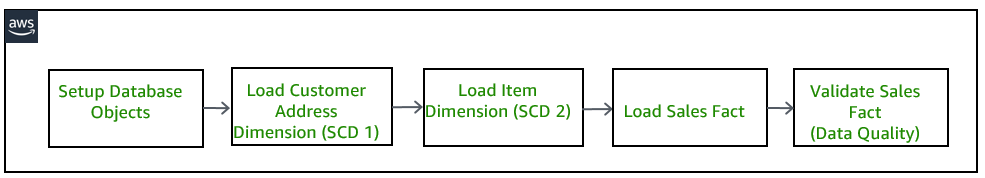
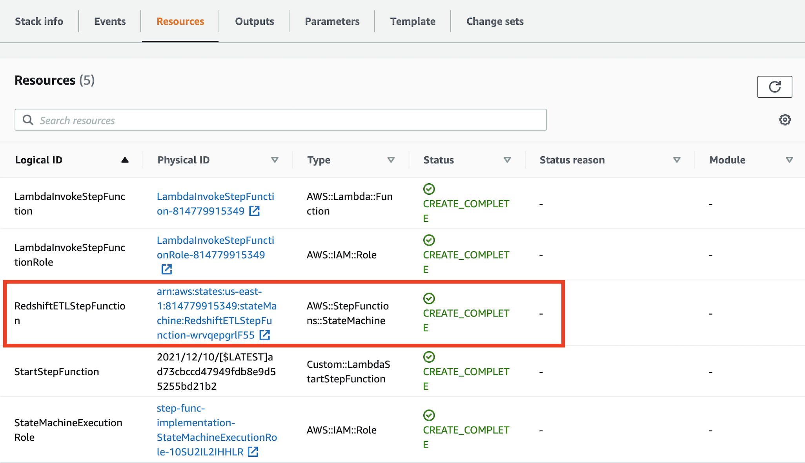
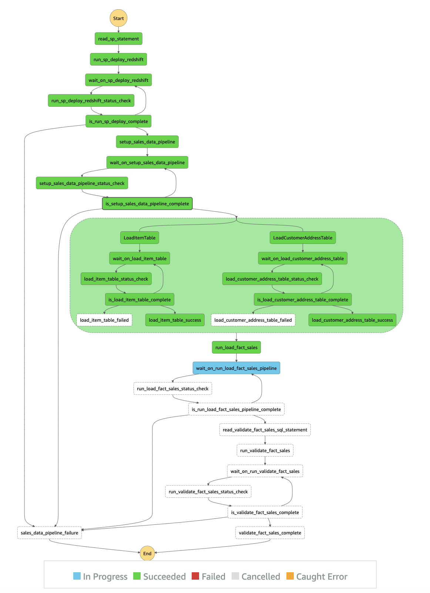
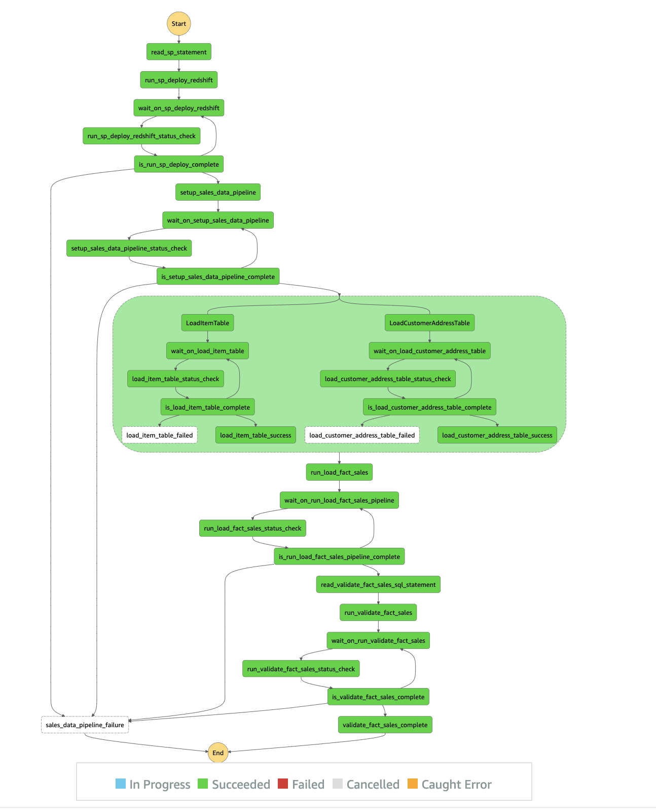

**Note**: This implementation DOES NOT use AWS Lambda in the ETL workflow. Everything is initiated via AWS Step Functions. If you want to incorporate AWS Lambda, please check out the other implementation.

# ETL Orchestration using Amazon Redshift Data API and AWS Step Functions
The [Amazon Redshift Data API](https://docs.aws.amazon.com/redshift/latest/mgmt/data-api.html) is suitable for use cases where you don’t need a persistent connection to a cluster. One of its applicable use case is building your ETL pipelines with [AWS Step Functions](https://aws.amazon.com/step-functions/). In this AWS Sample code, you will learn how to use AWS Step Functions and Amazon Redshift Data API to orchestrate the different steps in your ETL/ELT workflow that loads data into [Amazon Redshift](https://aws.amazon.com/redshift/) data warehouse. 

In this solution, [AWS Step Functions](https://aws.amazon.com/step-functions/) uses [Amazon Redshift Data API](https://docs.aws.amazon.com/redshift/latest/mgmt/data-api.html) to setup the required database objects and generate a set of sample data to be processed. It then executes two dimension jobs that performs SCD1 and SCD2 dimension load respectively, and once both jobs have been executed successfully only then will the load job for the fact table execute. And finally as a last step, it performs a validation to ensure the sales data  was loaded successfully.

In this example, `batch-execute-statement` is used to run multiple SQL statements in a batch as a part of a single transaction on the Amazon Redshift Data API. The SQL statements can be `SELECT`, `DML`, `DDL`, `COPY`, and `UNLOAD`. For more information, please checkout [BatchExecuteStatement API Documentation](https://docs.aws.amazon.com/redshift-data/latest/APIReference/API_BatchExecuteStatement.html). 

# Pre-requisites
As a pre-requisite for creating the application explained in this repo, you should need to setup an Amazon Redshift cluster and associate it with an AWS Identity and Access Management (IAM) [Role](https://docs.aws.amazon.com/redshift/latest/mgmt/authorizing-redshift-service.html). If you don’t have that provisioned in your AWS account, please follow Amazon Redshift getting started [guide](https://docs.aws.amazon.com/redshift/latest/gsg/getting-started.html) to set it up.

You will also need to download the following SQL scripts used in this solution and store them in your S3 bucket:

* [sp_statements.sql](scripts/sp_statements.sql) - Contains the stored procedures including DDL and DML operations.
* [validate_sql_statement.sql](scripts/validate_sql_statement.sql) - Contains two validation queries you can run.

# Solution Architecture
The following architecture diagram highlights the end-to-end solution:

In this sample, the triggering mechanism will be to [Start a new execution](https://docs.aws.amazon.com/step-functions/latest/dg/getting-started.html#start-new-execution) in the Step Functions console however AWS Step Functions can be executed in a number of ways as per the following:
* Call the [StartExecution](https://docs.aws.amazon.com/step-functions/latest/apireference/API_StartExecution.html) API action. 
* Use [Amazon CloudWatch Events](https://docs.aws.amazon.com/step-functions/latest/dg/tutorial-cloudwatch-events-s3.html) to start an execution. 
* Start an execution with [Amazon API Gateway](https://docs.aws.amazon.com/step-functions/latest/dg/tutorial-api-gateway.html). 
* Start a [nested workflow execution](https://docs.aws.amazon.com/step-functions/latest/dg/concepts-nested-workflows.html) from a Task state. 

Solution can be deployed with the [Cloud Formation Template](cloud_formation_template/etl-orchestration-with-stepfunctions-and-redshift-data-api.yaml) that creates the below resources: 
1. Database objects in the Amazon Redshift cluster
	* Five Redshift tables - to be used by the ETL workflow 
		1. customer
		2. customer_address
		3. date_dim
		4. item
		5. store_sales
2. [AWS IAM Role](https://docs.aws.amazon.com/IAM/latest/UserGuide/id_roles.html), `StateMachineExecutionRole` for AWS StepFunctions to allow below permissions:
    * Federate to the Amazon Redshift cluster through `getClusterCredentials` permission avoiding password credentials.
    * Execute queries in Amazon Redshift cluster through Redshift Data API calls
    * List and retrieves objects from Amazon S3
3. [AWS Step Functions state machine](https://docs.aws.amazon.com/step-functions/latest/dg/welcome.html), `RedshiftETLStepFunction` state machine contains the steps used to orchestrate/execute AWS services and build serverless applications. The state machine will execute SQL statements in Amazon Redshift leveraging the `redshift-data` client. The state machine directly reads parameterized SQL files stored in Amazon S3. The SQL files contain both DDL and DML scripts. The state machine can asynchronously execute Structured Query Language (SQL) statements in Amazon Redshift and thus avoid chances of timing-out in case of long running SQL statements. It uses [Amazon Redshift Data API's](https://docs.aws.amazon.com/redshift/latest/mgmt/data-api.html) temporary credentials functionality, which allows it to communicate with Amazon Redshift using AWS Identity and Access Management (IAM) permission, without the need of any password-based authentication. With Data API, there is also no need to configure drivers and connections for your Amazon Redshift cluster, which is handled automatically.

   	As there are multiple SQL statements that needs to be executed as a part of a single transaction to ensure data integrity, these SQL statements will be executed in a batch using the ["batch-execute-statement" API.](https://docs.aws.amazon.com/redshift-data/latest/APIReference/API_BatchExecuteStatement.html)

# Goal of the Archictecture  
1) Deploy Redshift Database Objects
2) Load a set of sample data 
3) Run the multi-step ETL process as per the defined job dependencies
4) Validate the data was processed successfully

# Steps
1. Once the [Cloud Formation Template](cloud_formation_template/etl-orchestration-with-stepfunctions-and-redshift-data-api.yaml) is deployed, go to the "Resources" and click on the Physical ID column of the `RedshiftETLStepFunction` in order to navigate to the [AWS Step Function](https://aws.amazon.com/step-functions/) console.

2. The CloudFormation includes a `StartStepFunction` resource that invokes a Lambda function `LambdaInvokeStepFunction` to execute the Step Function `RedshiftETLStepFunction` during the CloudFormation's stack creation. `RedshiftETLStepFunction` step function allows you to visualize the execution of the ETL workflow in real time.

Below steps outlines the workflow:

1. `read_sp_statement` & `run_sp_deploy_redshift`
	* Retrieves the [sp_statements.sql](scripts/sp_statements.sql) from S3 to get the stored procedure 
	* Pass stored procedure to the ["batch-execute-statement" API](https://docs.aws.amazon.com/redshift-data/latest/APIReference/API_BatchExecuteStatement.html) to run in the [Amazon Redshift](https://aws.amazon.com/redshift/) cluster
	* Sends back the identifier of the SQL statement to the step function 			
2. `wait_on_sp_deploy_redshift`
	* Waits for at least 5 seconds
3. `run_sp_deploy_redshift_status_check`
	* Invokes the Amazon Redshift Data API's `describeStatement` to get the status of the API call
4. `is_run_sp_deploy_complete` - routes the next step of the ETL workflow as per the following:
	* FINISHED - Stored procedures are created in your Amazon Redshift cluster
	* FAILED - Go to `sales_data_pipeline_failure` step and fail the ETL workflow
	* All other status - Go back to the `wait_on_sp_deploy_redshift` step to wait for the SQL statements to finish

5. `setup_sales_data_pipeline`
	* Initiates the Setup stored procedure that was previously created in the Redshift cluster.
	* Sends back the identifier of the SQL statement to the step function 			
6. `wait_on_setup_sales_data_pipeline`
	* Waits for at least 5 seconds
7. `setup_sales_data_pipeline_status_check`
	* Invokes the Amazon Redshift Data API's `describeStatement` to get the status of the API call
8. `is_setup_sales_data_pipeline_complete` - routes the next step of the ETL workflow as per the following:
	* FINISHED - Created two dimension tables (customer_address and item) and one fact table (sales)
	* FAILED - Go to `sales_data_pipeline_failure` step and fail the ETL workflow
	* All other status - Go back to the `wait_on_setup_sales_data_pipeline` step to wait for the SQL statements to finish

9. `run_sales_data_pipeline` 
	* `LoadItemTable` & `LoadCustomerAddressTable` are two parallel workflows that AWS Step Functions will execute at the same time. The two parallel workflows will execute the stored procedures that was previously created. The stored procedure loads the data into the tables that were created: `item` and `customer_address` tables.
	* All other steps in the parallel sessions follow the same concept as what was described above.
	* After both parallel workflows are complete, `run_load_fact_sales` will execute. 

10. `run_load_fact_sales` 
	* Inserts data into into the `store_sales` table that was created in the initial executed stored procedure. 

11. Validation
	* After all ETL steps are complete, the state machine will read a second SQL file from Amazon S3 - [validate_sql_statement.sql](./scripts/validate_sql_statement.sql) and execute the two SQL statements using the `batch_execute_statement` method. 
		
**Note**: The implementation of the ETL workflow is idempotent. If it fails, you can retry the job without any cleanup. For example, it recreates the `stg_store_sales` table each time, then deletes target table `store_sales` with the data for the particular refresh date each time.

# Validation
The entire ETL workflow takes around 1 minute to run and you should see the following diagram when the ETL workflow execution completed successfully.

