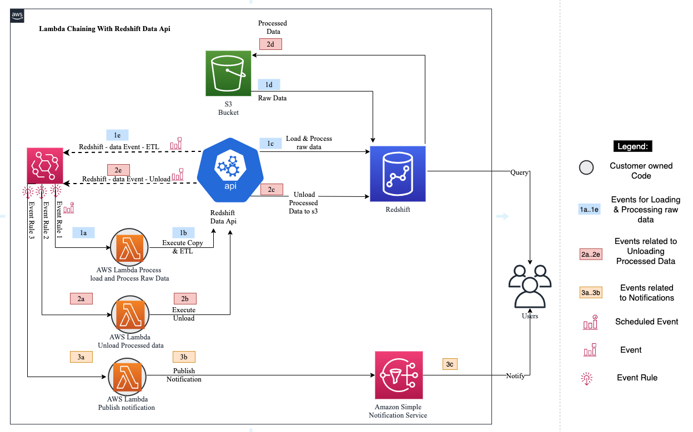
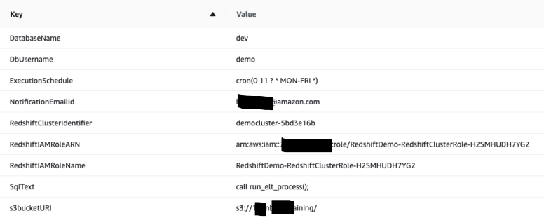
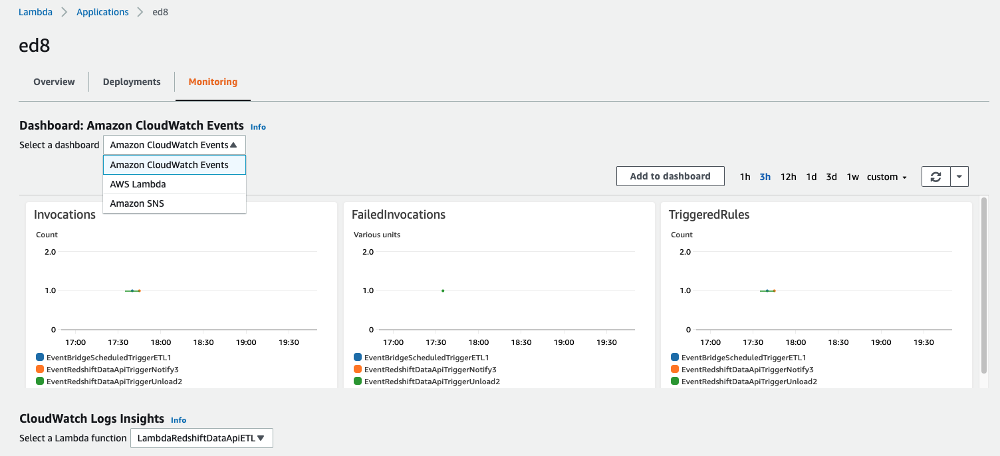

# Serverless Data Processing Workflow using Redshift Data Api
In this AWS Sample code, you will learn how to use Amazon Redshift Data Api and Amazon Event bridge to run a Serverless data processing workflow against Amazon Redshift data warehouse by coordinating multiple AWS Lambda Functions.  The [ Amazon Redshift Data API ](https://docs.aws.amazon.com/redshift/latest/mgmt/data-api.html) enables you to painlessly access data from Amazon Redshift with all types of traditional, cloud-native, and containerized, serverless web services-based applications and event-driven applications.  [AWS Lambda](https://aws.amazon.com/lambda/)  is a compute service that lets you run code without provisioning or managing servers. The [Amazon Event Bridge](https://aws.amazon.com/eventbridge/) is a serverless event bus that makes it easier to build event-driven applications at scale using events generated from your applications. The [Amazon Simple Notification Service (Amazon SNS)](https://aws.amazon.com/sns/) is a fully managed messaging service for both application-to-application (A2A) and application-to-person (A2P) communication.

One can think about developing this serverless data processing with one lambda function calling other Lambda function but one might end up managing all of those connections will become challenging as workflow becomes more sophisticated. Not only this, any changes in the flow of the application will require changes in multiple places, Lambda functions are not decoupled and gives major challenges maintaining the links.   

In this solution, we show you how Amazon Redshift Data Api and Amazon Event Bridge can help build the orchestration that lets you easily coordinate multiple Lambda functions into flexile workflows that are easy to debug and easy to change. Redshift Data Api Client and Event Bridge rules will keep your Lambda Functions free of additional logic by triggering and tracking each step of your application for you. 

Some of the business use case for this design are building event-driven data warehouse, orchestrating serverless data loads with multiple Lambdas without connecting them together and several micro ETL workflows to support streaming data ingestion.

This serverless architecture offers greater extensibility and simplicity, making it easier to maintain, faster to release new features and also reduce the impact of changes. It also simplifies adding other components third-party products to the application without much changes. 

# Pre-requisites
As a pre-requisite for creating the application explained in this blog, you should need to setup an Amazon Redshift cluster and associate it with an AWS Identity and Access Management (IAM) [Role](https://docs.aws.amazon.com/redshift/latest/mgmt/authorizing-redshift-service.html). If you don’t have that provisioned in your AWS account, please follow Amazon Redshift getting started [guide](https://docs.aws.amazon.com/redshift/latest/gsg/getting-started.html) to set it up.

# Solution Architecture

# Goal of this Archictecture is 
1) Deploy Redshift Database Objects
2) Copy raw data from S3 and run ETL Steps 
3) Unload processed data back to S3
4) Notify user once the unload job is finished 

# Steps
Below steps outlines the workflow at high level.  Solution can be deployed with following [Cloud Formation Template](cloud_formation_template/lambda-chaining-with-redshift-data-api.yaml)

1. When Cloud formation template is deployed it triggers Lambda function to deploy database Objects on the Amazon Redshift Cluster
    1. Table "nyc_yellow_taxi" which will be used to copy above New York taxi dataset from Amazon S3.
    2. Materialized view "nyc_yellow_taxi_volume_analysis" providing an aggregated view of above table
    3. Stored procedure "execute_elt_process", to take care of data transformation

2. Event Bridge rule, EventBridgeScheduledTriggerETL (*1a*) to be triggered periodically based on cron expression.

3. AWS IAM Role, “LambdaRedshiftDataApiETLRole” for AWS Lambda to allow below permissions:
    1. Federate to the Amazon Redshift cluster through getClusterCredentials permission avoiding password credentials.
    2. Execute queries in Amazon Redshift cluster through redshift-data API calls
    3. Logging with AWS CloudWatch for troubleshooting purpose
    4. Send notifications through Amazon Simple Notification Service (SNS)

4. AWS Lambda function, “LambdaRedshiftDataApiETL”, which is triggered automatically with action “run_sql” as soon as above scheduled event (step 3) gets executed. It performs 
    1. 1b - an asynchronous call to the stored procedure "execute_elt_process" in Amazon Redshift, performing extract, load and transform (ELT) operations leveraging Amazon Redshift Data API functionality. 
    2. 1c- This AWS Lambda function will execute queries in Amazon Redshift leveraging “redshift-data” client. Based on the input parameter “action”, this lambda function can asynchronously execute Structured Query Language (SQL) statements in Amazon Redshift and thus avoid chances of timing-out in case of long running SQL statements. It uses [Amazon Redshift Data API](https://docs.aws.amazon.com/redshift/latest/mgmt/data-api.html) temporary credentials functionality, which allows it to communicate with Amazon Redshift using AWS Identity and Access Management (IAM) permission, without the need of any password-based authentication. With Data API, there is also no need to configure drivers and connections for your Amazon Redshift cluster, which is handled automatically.
    3. 1d - Redshift executes Copy command and Runs stored procedure to process the raw data and load into final target table.

5. Amazon EventBridge rule, “EventRedshiftDataApiTriggerUnload” (2a) automatically captures completion event generated by above stored procedure call (1e). This triggers a new AWS Lambda function LambdaRedshiftDataApiUnload with action "run_sql". It performs
    1. 2b-invokes Redshift Data Api client 
    2. 2c- an asynchronous unload call in Amazon Redshift. 
    3. 2d- unload processed data to a S3 bucket. 

6. Amazon EventBridge rule, “EventRedshiftDataApiTriggerNotify” (3a)  to automatically capture completion event, generated by above unload command. This triggers above AWS Lambda function “LambdaRedshiftDataApiUnload” again with action "notify" (3b)

7. AWS Simple Notification Service (SNS) topic, RedshiftNotificationTopicSNS and subscription to your emailid sends an automated email notification denoting completion of Unload process (3c).

8. The database objects mentioned in Step#1 above are provisioned automatically by a lambda function, [LambdaSetupRedshiftObjects](scripts/LambdaRedshiftSetupObjects.py) as part of the [CloudFormationtemplate](cloud_formation_template/lambda-chaining-with-redshift-data-api.yaml) through an invocation of the lambda function, [LambdaRedshiftDataApiETL](scripts/LambdaRedshiftDataApiETL.py) created in step# 4 above.  During CFT deployment time, subscription email is sent to the emailId, user has to accept the subscription link in order to receive alert notifications.  Below are the parameters that are set when deploying Cloud formation template
   
 

# Validation
1. After you deploy the cloud formation template, you should have an automated serverless data pipeline orchestrated by Event bridge and Redshift Data Api Client. Initial pipeline must be triggered by setting a schedule in Amazon Event Bridge Scheduled Rules’ cron expression. Once ETL lambda is triggered based on time based event, rest of the processing is auto triggered.  Redshift Data Api is helping to orchestrate these workflows.   For verification purpose you may view amazon cloud logs or if Cloud formation template is used to deploy the solution then resources, for example, event bridge rules, Lamdba Functions and SNSs are grouped under the application with name given for cloud formation stack.  Below screen capture shows the application with various metrics

2. You could also view the query execution status in Amazon Redshift Console found under queries tab
3. After this process is complete, you will receive a notification email stating that unload process has been completed. 

