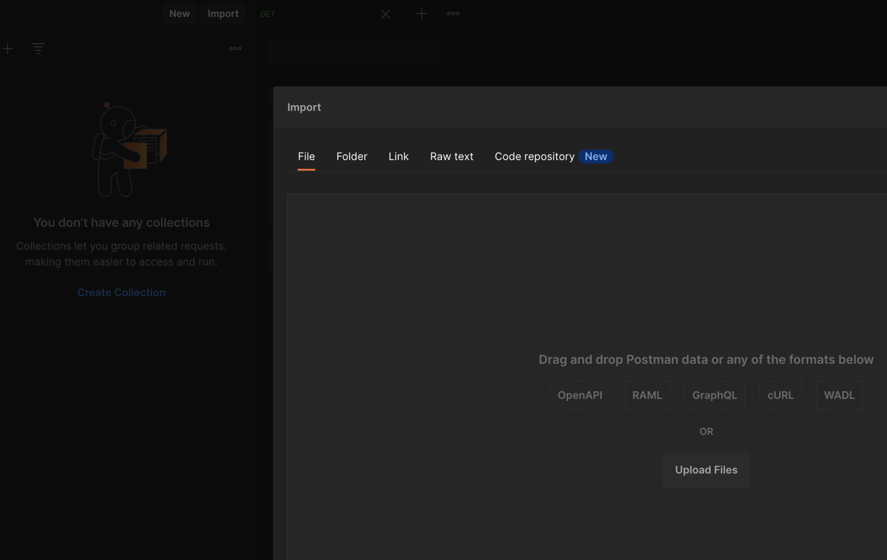
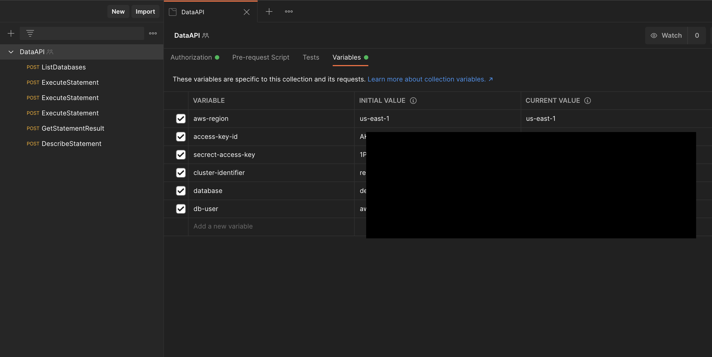
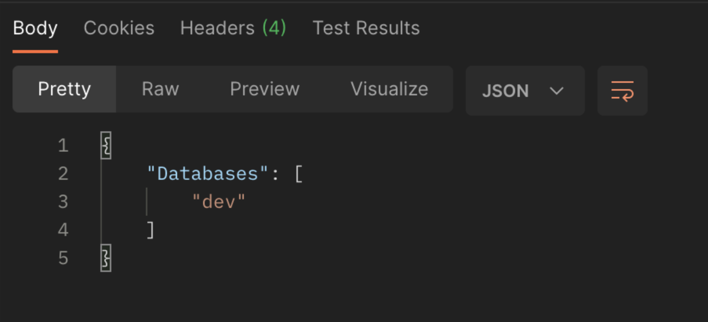
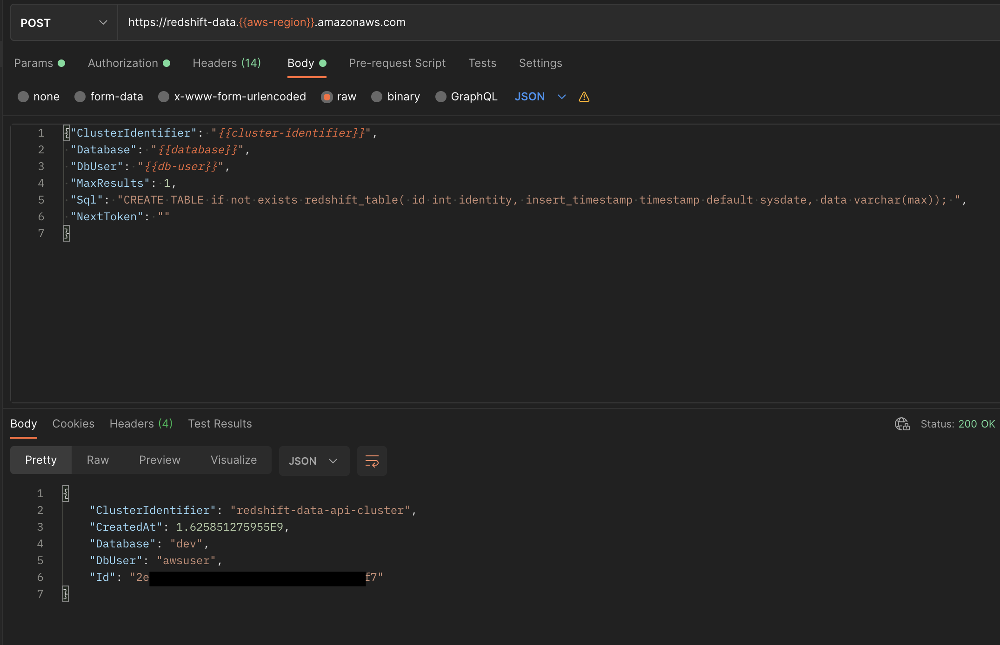
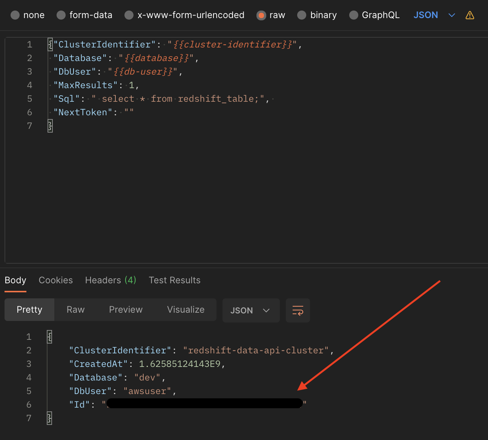
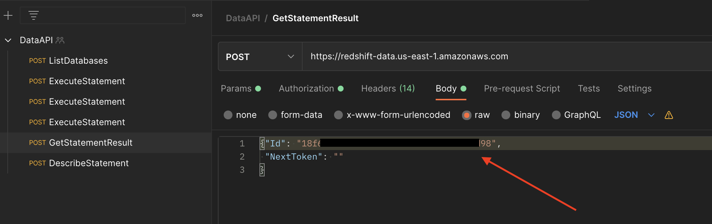
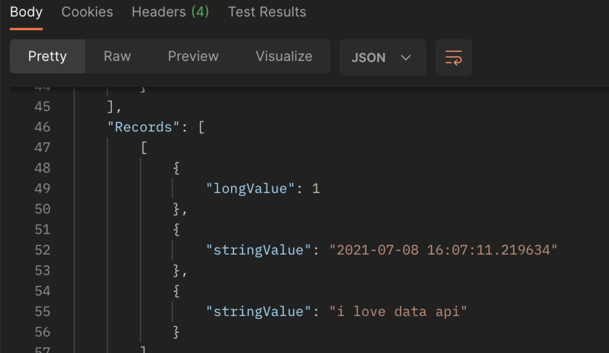
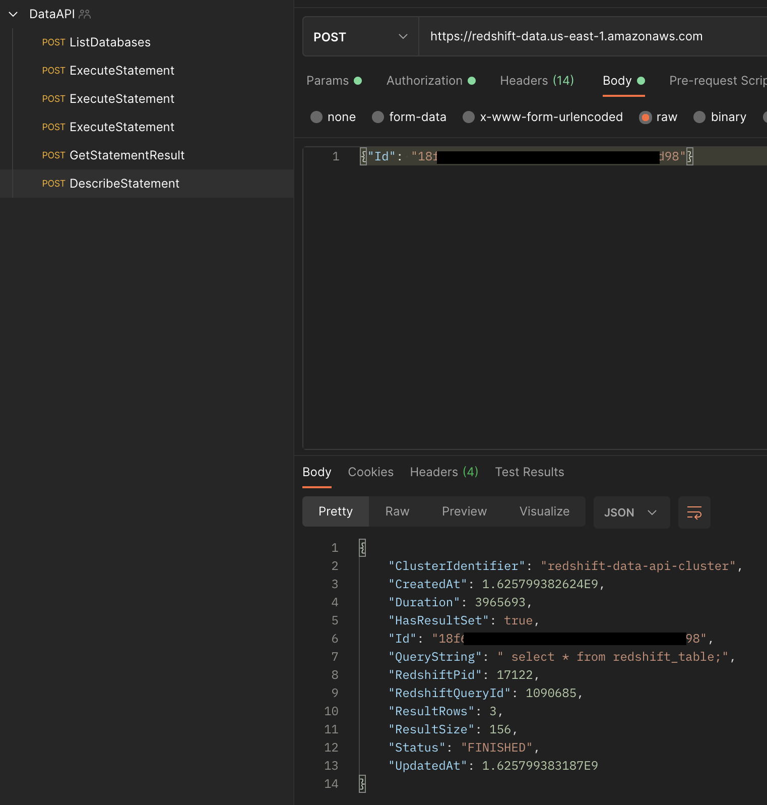

# REST for Redshift Data API

In this tutorial, you will learn how to perform API calls directly to [Amazon Redshift Data API](https://docs.aws.amazon.com/redshift/latest/mgmt/data-api.html) without any intermediately service or step. You can use any API client to perform a variety of actions on your Amazon Redshift cluster and Amazon Redshift Data API. 

The URL for the Amazon Redshift Data API is: https://redshift-data.us-east-1.amazonaws.com 

Amazon Redshift Data API offers the following actions:

* [CancelStatement](https://docs.aws.amazon.com/redshift-data/latest/APIReference/API_CancelStatement.html)
* [DescribeStatement](https://docs.aws.amazon.com/redshift-data/latest/APIReference/API_DescribeStatement.html)
* [DescribeTable](https://docs.aws.amazon.com/redshift-data/latest/APIReference/API_DescribeTable.html)
* [ExecuteStatement](https://docs.aws.amazon.com/redshift-data/latest/APIReference/API_ExecuteStatement.html)
* [GetStatementResult](https://docs.aws.amazon.com/redshift-data/latest/APIReference/API_GetStatementResult.html)
* [ListDatabases](https://docs.aws.amazon.com/redshift-data/latest/APIReference/API_ListDatabases.html)
* [ListSchemas](https://docs.aws.amazon.com/redshift-data/latest/APIReference/API_ListSchemas.html)
* [ListStatements](https://docs.aws.amazon.com/redshift-data/latest/APIReference/API_ListStatements.html)
* [ListTables](https://docs.aws.amazon.com/redshift-data/latest/APIReference/API_ListTables.html)

Please also refer to Amazon Redshift Data API’s documentation as you progress in this tutorial: [API Reference Page](https://docs.aws.amazon.com/redshift-data/latest/APIReference/API_Operations.html)

## Prerequisite

* AWS IAM User 
    * Access Key ID
    * Secret Access Key ID
    * Attached `AmazonRedshiftDataFullAccess` permission 
* An API client 
* An available Amazon Redshift cluster in the `us-east-1` region

## Walk-through 

In this tutorial, we will be using Postman as our API client and utilize `ListDatabases`, `ExecuteStatement`, `GetStatementResult`, and `DescribeStatement` action to get you started. 

Download the JSON file in this folder and import it as a collection to Postman. 

After you import, you’ll see a list of POST methods in your collection named: DataAPI. 

* ListDatabases
* ExecuteStatement
* ExecuteStatement
* ExecuteStatement
* GetStatementResult
* DescribeStatement

Under the DataAPI collection page, go to the Variables tab (highlighted in the screenshot below) and populate the variables with your AWS resource details. 

Once you have populated the variables, we can first start off by listing the number of databases in our Amazon Redshift cluster. 

Under the ListDatabases page, go to the tab named “Body” to check what request body we are sending to the Redshift Data API. Afterwards, click send. The response should look similar to the screenshot below. 

Additional information about ListDatabases can be found here: [ListDatabases Link](https://docs.aws.amazon.com/redshift-data/latest/APIReference/API_ListDatabases.html)

Next, go to the first ExecuteStatement method listed and fill in the appropriate values under the “Body” tab. In this example, we’re leveraging Amazon Redshift Data API to create a table within the “dev” database. 

Additional information about ExecuteStatement can be found here: [ExecuteStatement Link](https://docs.aws.amazon.com/redshift-data/latest/APIReference/API_ExecuteStatement.html)

Repeat the above step for the 2nd and 3rd ExecuteStatement. Notice the only difference between the three ExecuteStatement methods are the SQL statements underneath each request body. You may alter it to be a variable to reduce redundancy if you'd like. 

Each SQL action will return a statement Id. You may use this Id to monitor the status and other details about the SQL query. One example is to retrieve the data that is returned by a SQL query.

Once you’re on the 3rd ExecuteStatement, copy down the Id that’s given in the response. 

To get retrieve the results from the SELECT query that we previously called in the 3rd the ExecuteStatement API call, paste the Id that was copied into the body of the GetStatementResult request body. 

**Note:** You may also use Postman variables to store the statement if depending on your use-case. 

Click send and you will receive values from your redshift_table that you previously created in the first ExecuteStatement API call.

Additional information about GetStatementResult can be found here: [GetStatementResult Link](https://docs.aws.amazon.com/redshift-data/latest/APIReference/API_GetStatementResult.html)

For long running queries, you can the status and other information about your query with the DescribeStatement action. 

Additional information about DescribeStatement can be found here: [DescribeStatement Link](https://docs.aws.amazon.com/redshift-data/latest/APIReference/API_DescribeStatement.html)

Paste the statement Id that you want to monitor into the request body and click send. 

 Please checkout the quick-start guides to leverage Amazon Redshift Data API in your codebase. 
