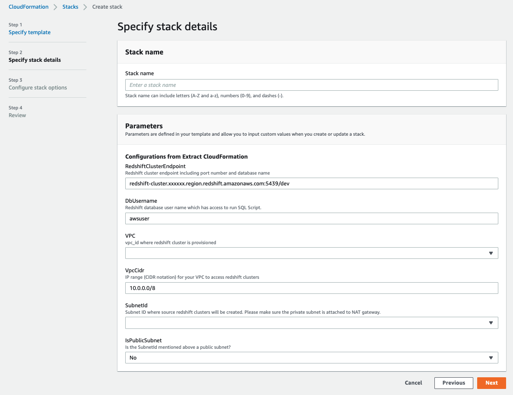

# Using the Amazon Redshift Data API to interact from an Amazon SageMaker Jupyter notebook

In this AWS Sample code, you will learn how to use [Amazon Redshift Data API](https://docs.aws.amazon.com/redshift/latest/mgmt/data-api.html) to access your Amazon Redshift Data Warehouse seamlessly using [Amazon Sagemaker Notebook](https://docs.aws.amazon.com/sagemaker/latest/dg/nbi.html), which is very popular with the data scientist community.

In this repository, we are demonstrating how to use Redshift Data API to access and visualize data from Redshift and create an regression ML model with Redshift ML as explained in this [AWS Blogpost](https://aws.amazon.com/blogs/machine-learning/build-regression-models-with-amazon-redshift-ml/).

Below are the notebooks used here
### Redshift provisioned
[notebook file for redshift provisioned](redshift_ml_with_data_api.ipynb)

### Redshift serverless
[notebook file for redshift serverless](redshift_serverless_ml_with_data_api.ipynb)

which connects with Amazon Redshift using IAM credentials without any password management hassles. It then fetches Redshift data directly into a Pandas data frame, which makes it easy and seamless for data scientists to work and analyze that data. At the end, we created an ML model in Amazon Redshift ML and ran predictions from that model.

You may provision this notebook instance using this [CloudFormation Template](cf-template-sagemaker-notebook.yaml) after inputting below parameters. It needs your Redshift cluster endpoint and VPC, Subnet  info for that cluster to provision a notebook instance, which can connect and query that cluster.


The documentation for your ExecuteStatement can be found [here](https://docs.aws.amazon.com/redshift-data/latest/APIReference/API_ExecuteStatement.html).

### Redshift provisioned
```python
res = client.execute_statement(Database=REDSHIFT_ENDPOINT.split('/')[1], DbUser=REDSHIFT_USER, Sql=sql_text,
                               ClusterIdentifier=REDSHIFT_ENDPOINT.split('.')[0])
```

### Redshift serverless
```python
res = client.execute_statement(Database=REDSHIFT_DATABASE_NAME, WorkgroupName=REDSHIFT_WORKGROUP_NAME, Sql=sql_text)
```